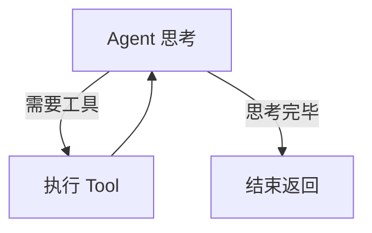

# 知识模块文档 (README.md) 编写规范

为了让 `ailearning` 项目成为高价值的工程化知识库，所有的模块 README.md 都必须严格遵循以下结构规范，绝对不能遗漏核心沉淀部分（特别是代码原理解析与执行命令）。

## 必须包含的核心结构

当你需要为任何模块编写或更新 `README.md` 时，必须确保包含以下 Markdown 标题结构：

### 1. 🎯 核心目标与应用场景
- `## 🎯 核心目标与应用场景`：
  - 用一两句话讲清楚本模块要解决的业务痛点。
  - **应用场景**：列举 2-3 个真实业务中会用到该技术的具体场景。

### 2. 🧠 技术原理与架构流程图 (强制要求)
- `## 🧠 技术原理与架构流程图`
- **规范说明**：对模块中涉及到的底层技术原理进行深入浅出的人话解释。必须让复盘者知道**为什么**要这么写。
- **架构流程图**：必须使用 `mermaid` 语法，绘制出核心代码的流转链路或系统架构图。

### 3. 🛠️ 操作方法与执行命令 (强制要求)
- `## 🛠️ 操作方法与执行命令`
- **规范说明**：必须按执行的先后顺序列出所有核心的 Shell/Terminal 命令。
- 要求：
  1. 使用带有 `bash` 语法高亮的代码块。
  2. 每一条命令上方必须用文字说明目的，保持“Copy-Paste Ready”。

### 4. ⚠️ 注意事项与踩坑记录 (强制要求)
- `## ⚠️ 注意事项与踩坑记录`
- **规范说明**：记录必须注意的环境配置要求、版本约束，以及实战中遇到的报错现象、原因分析和解决方案。

## 示例模板参考

```markdown
# 20-agent-frameworks · 高阶 Agent 开发

## 🎯 核心目标与应用场景
跳出单次对话，利用 LangChain 构建生产级有状态 Agent。
**应用场景**：代码自动纠错助手、客服工单多步流转审核。

## 🧠 技术原理与架构流程图
### 状态机原理
Agent 被建模为状态机，不断根据当前状态判断流转。


## 🛠️ 操作方法与执行命令
**1. 运行 Agent**
\`\`\`bash
python 20-agent-frameworks/basic_agent.py
\`\`\`

## ⚠️ 注意事项与踩坑记录
- **Checkpointer**：如果是无状态图，绝不能调用 `get_state()`，否则会报 `ValueError`。
```

## 执行约束
每次用户要求“进入下一个章节”、“整理文档”、“对某章节进行总结”时，AI 助手必须自动回顾此规范，并使用文件编辑工具对目标模块的 `README.md` 进行规范化结构重构或增补。
