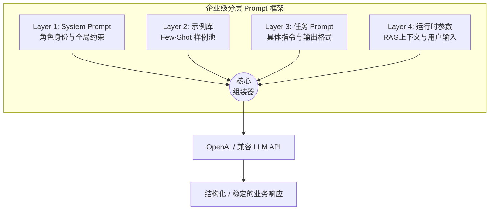

# 01-prompt-engineering · 提示词工程核心技术与框架

## 🎯 核心目标与应用场景
解决大模型回答不稳定、不符合业务规范、以及难以复用与维护的问题。通过引入基础角色设定、Prompt 模板、思维链（CoT）、少样本学习（Few-shot）以及企业级分层 Prompt 框架，将大模型的输出变得可控、精准且高度工程化。
- **应用场景**：
  - **智能客服与合规机器人**：使用分层框架（如 System Prompt + 示例库 + 运行时参数）控制 AI 人设，严守底线，避免回答违规内容。
  - **复杂逻辑推理**：借助 Chain of Thought 让模型分步思考（如数学运算、故障排查），显著降低幻觉并提高逻辑准确率。
  - **特定格式化输出转换**：利用 Few-shot 和 Prompt Templates 强制模型学习特定业务黑话或输出稳定的 JSON 格式结构。

## 🧠 技术原理与架构流程图
提示词工程（Prompt Engineering）是将人类意图转换为大模型能听懂并高效执行的指令技术。
- **模板化与少样本学习**：通过模板（Templates）将动态业务数据与静态提示词解耦；通过提供少量正确示例（Few-Shot），让模型低成本“照猫画虎”。
- **思维链 (CoT)**：要求大模型“详细写出思考步骤”，用输出换时间，从而获得正确的最终答案。
- **企业分层框架**：将 Prompt 拆分为四层：底层稳定（角色与约束）、示例库（灵活插拔）、任务层（本次指令）和运行层（动态参数），彻底告别“面条式” Prompt 拼凑，实现可版本控制的高可用管理。



## 🛠️ 操作方法与执行命令

配置依赖与环境变量
```bash
# 确保项目目录下已配置好 .env 文件，需包含 OPENAI_API_KEY
```

运行基础提示词角色扮演示例
```bash
python 01_basic_prompts.py
```

运行 Prompt 模板动态填充测试
```bash
python 02_prompt_templates.py
```

执行思维链（CoT）逻辑推理实验
```bash
python 03_chain_of_thought.py
```

测试少样本学习（Few-shot）风格迁移实验
```bash
python 04_few_shot_prompts.py
```

对比 Few-shot 和 CoT 的效果差异
```bash
python 05_few_shot_vs_cot_comparison.py
```

演示企业级四层 Prompt 框架如何组装并预览
```bash
python prompt_framework.py
```

## ⚠️ 注意事项与踩坑记录
- **环境变量缺失**：如果运行时提示 `OPENAI_API_KEY` 错误，请检查是否在 `.env` 文件中正确配置了有效密钥，且当前环境中已经成功加载了环境变量。
- **模型性能差异**：不同模型（如 `deepseek-v4-flash` 或 `gpt-4o`）对 Prompt 的敏感度和推理能力不同，思维链或 Few-Shot 样例在切换模型时可能需要重新调试。
- **Token 消耗膨胀**：在使用企业级分层框架（特别是在 Layer 4 注入大规模检索文档时），容易造成 Token 暴涨。注意限制示例注入数量，建议在生产环境调整 `max_examples` 保护上下文窗口。
