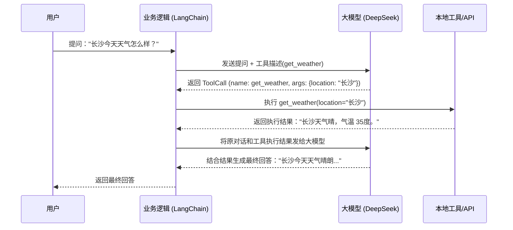

# 02-function-calling · 函数调用基础与数据验证
## 🎯 核心目标与应用场景
- 解决大模型自身无法获取实时信息、执行实际操作以及输出非结构化不可靠数据的痛点，实现模型与外部世界的可靠交互。
- **应用场景**：
  1. 智能客服查询用户实时订单或天气信息。
  2. 提取非结构化文本中的关键信息，并校验其符合规范（如邮箱格式、年龄范围）。
  3. 执行后台系统 API（如发送邮件、操作数据库）并给出反馈。

## 🧠 技术原理与架构流程图
- **Function Calling（函数调用）**：让大模型知道你有哪些可用的工具（函数），在需要时，模型不直接回答，而是输出期望调用的工具及参数。接着，你在本地执行该工具并将结果返回给模型，模型再基于结果生成最终回复。
- **Pydantic 数据验证**：通过定义严谨的数据结构模型，对模型的输出参数或用户输入进行拦截和清洗，确保传入函数或返回给用户的数据安全合规。



## 🛠️ 操作方法与执行命令
- 安装相关的依赖（如果未安装）：
```bash
pip install langchain-openai python-dotenv pydantic
```
- 运行 Pydantic 核心功能演示，学习数据结构和类型验证拦截：
```bash
python pydantic_intro.py
```
- 运行基础 Function Calling 示例，观察模型如何进行工具调用与结合工具输出的二次回答：
```bash
python 01_basic_function_calling.py
```

## ⚠️ 注意事项与踩坑记录
- **DeepSeek reasoning_content 兼容性问题**：在使用 LangChain 的 ChatOpenAI 接入 DeepSeek 等带有推理阶段的模型时，如果在工具调用过程中带有推理字段 (`reasoning_content`)，LangChain 的原生代码在构建带 ToolMessage 的下一轮 payload 时可能会丢弃该字段，引发 API 调用报错。模块中的代码提供拦截并保存 `reasoning_content` 的机制。
- **环境变量配置**：需在项目的 `.env` 中正确设置 `OPENAI_API_KEY` 及 `OPENAI_API_BASE`。
- **数据脏字段风险**：结合大模型输出的 JSON 使用时，可能会收到格式错乱或非法值，强依赖 `Pydantic` 可避免这些脏数据流入下游核心业务层，最好配置重试策略。
</02-function-calling · 函数调用基础与数据验证>
