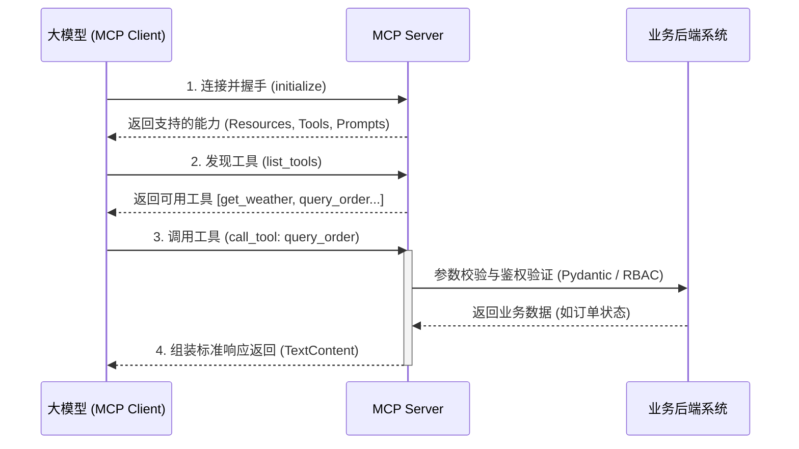

# 03-mcp · 学习 MCP 协议核心概念与服务端开发

## 🎯 核心目标与应用场景
- **业务痛点**：大模型通常是一个“孤岛”，无法直接读取本地文件、数据库或安全地调用企业内部的 API，导致其无法结合业务的实时数据进行准确决策与操作。
- **应用场景**：
  1. **企业数据挂载**：通过 MCP 暴露 `memo://` 等资源，让大模型合规地读取实时业务报表、系统日志或团队 Wiki。
  2. **自动化业务流**：封装 MCP 工具（Tools），授权大模型执行结构化的核心业务链路，如查询订单状态、发起安全的退款申请等。
  3. **标准交互模板**：利用 MCP 的 Prompts 功能提前定义好特定场景的工作流（如“检查城市天气并生成简报”），降低大模型交互门槛。

## 🧠 技术原理与架构流程图
MCP (Model Context Protocol) 是一种标准化协议，充当大模型与外部数据/工具之间的“USB 接口”。正如 HTTP 协议连接浏览器与服务器，MCP 建立了 AI 客户端（如 Claude Desktop 或自定义脚本）与业务数据源的双向通道。它基于三大基石运行：**Resources**（模型只读的数据源）、**Tools**（模型可调用的业务函数）以及 **Prompts**（可重用的指令模板）。通信过程一般基于标准的 `stdio` (标准输入输出) 或网络 SSE 协议，并能够集成完善的参数校验和基于 RBAC 的权限管控机制。



## 🛠️ 操作方法与执行命令
安装 MCP 及其依赖包（如 Pydantic）以支撑核心开发：
```bash
pip install mcp pydantic
```

运行基础客户端测试，它会自动启动并连接基础的服务端，演示资源读取和工具调用：
```bash
python 03-mcp/02_simple_client.py
```

执行企业级 MCP 服务端测试用例，验证参数合法性校验与越权拦截机制：
```bash
python 03-mcp/03_enterprise_mcp_server.py
```

## ⚠️ 注意事项与踩坑记录
- **环境要求**：建议使用 Python 3.10 及以上版本，必须安装 `mcp` 官方 Python SDK。
- **通信流污染**：使用 `stdio` 方式连接 Server 时，Server 端代码绝对不能随便使用 `print` 打印日志，这会污染标准输出流导致 Client 解析 JSON-RPC 协议失败（表现为握手超时或解析报错），应使用标准的日志库将日志输出到文件或 stderr。
- **参数幻觉拦截**：大模型生成工具调用参数时极易出现格式错误。在 Server 端必须使用强类型框架（如 `Pydantic` 正则校验）进行拦截，并将友好的错误说明返回，以便大模型触发自我反思 (Reflection) 进行重试。
- **高危越权风险**：Tools 中的敏感操作（如订单退款、数据删除）不能依赖大模型自身的道德对齐。必须在 Server 实现中引入鉴权机制（如 Token 与 RBAC），强制对来源请求做最终安全兜底。
