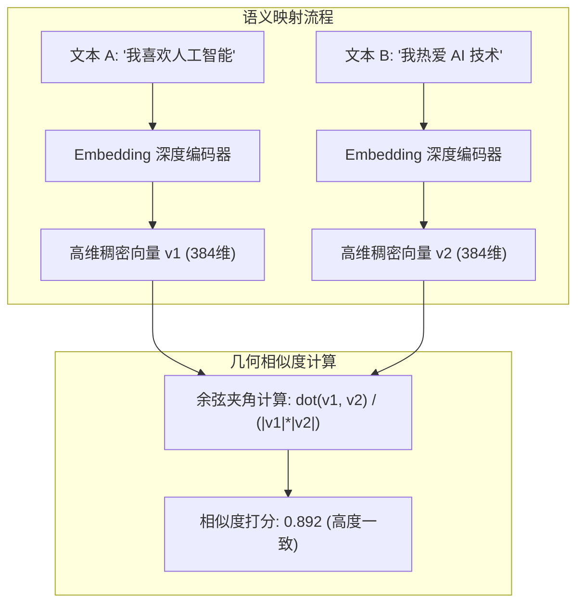

# 05-embedding · 文本向量化、空间几何与语义相似度算法

## 🎯 核心目标与应用场景
- **业务痛点**：计算机与大模型本质上只能处理数字，无法直接在数学上对自然语言文本进行“相似度比对”、“聚类分类”或“高效检索”。传统的字符串精确匹配（如 SQL LIKE 或正则表达式）无法理解“土豆”与“马铃薯”、“我喜欢AI”与“我热爱人工智能”之间的同义关系；而纯统计分词（如 TF-IDF）忽略了词序与深层上下文语义。
- **核心目标**：深入理解文本向量化（Representation Learning / Embedding）的底层数学本质，掌握高维向量空间几何、余弦相似度算法（Cosine Similarity）与点积的区别，掌握稠密向量在实际工程中的语义边界与缺陷（如对否定句“不”的盲区）。
- **应用场景**：
  1. **RAG 向量召回 (Dense Retrieval)**：将百万级知识库切片转化为固定维度向量，通过最近邻搜索（ANN）毫秒级召回最相关的上下文。
  2. **意图识别与语义分类**：对比用户提问与预设意图库的标准问向量，根据相似度阈值精准命中业务分支（如“退款”、“查快递”）。
  3. **去重与语义聚类**：对客户工单、社区海量帖子进行无监督语义聚类，自动挖掘高频投诉热点。

---

## 🧠 技术原理与架构流程图

### 1. 向量空间与余弦相似度 (Cosine Similarity)
Embedding 模型（如 BERT、MiniLM、text-embedding-3）将变长的文本映射为固定长度的高维稠密浮点数向量（如 384 维、1536 维）。
在几何空间中，两条向量之间的方向夹角 $\theta$ 越小，说明两个文本的语义越接近。

余弦相似度数学公式定义为向量内积除以各自模长的乘积：
$$\text{Cosine Similarity}(A, B) = \frac{A \cdot B}{\|A\| \|B\|} = \frac{\sum_{i=1}^{n} A_i B_i}{\sqrt{\sum_{i=1}^{n} A_i^2} \sqrt{\sum_{i=1}^{n} B_i^2}}$$

- 相似度取值区间：$[-1, 1]$（自然语言 Embedding 通常集中在 $[0, 1]$）。
- **与欧氏距离 (Euclidean Distance) 的区别**：余弦相似度只衡量“方向”，忽略向量的“绝对模长”，对文本长度差异更鲁棒；若向量已进行 $L_2$ 归一化（模长为 1），则余弦相似度直接等价于向量点积（$A \cdot B$），计算速度提升数倍。



---

## 🛠️ 操作方法与执行命令

**1. 运行余弦相似度与高维向量夹角计算实战**
```bash
python 05-embedding/01_cosine_similarity.py
```

**2. 运行多模型（中英/否定句盲区）能力对比实验**
```bash
python 05-embedding/02_model_comparison.py
```

---

## ⚠️ 注意事项与踩坑记录
1. **否定词与逻辑盲区（致命坑点）**：
   - 通用 Embedding 模型在训练时主要利用对比学习（Contrastive Learning）拉近上下文共现词。对于 `我喜欢AI` 与 `我不喜欢AI`，由于两者词汇重合度极高（80%以上词相同），通用模型给出的余弦相似度经常高达 `0.75 ~ 0.85`！
   - **工程解法**：在生产环境不可单纯依赖 Embedding 做精确的否定逻辑裁决，必须前置引入意图分类模型或结合规则/AST 语法树解析。
2. **维度灾难与索引膨胀**：
   - 向量维度越大（如 1536 vs 384），对复杂概念表达越充分，但会带来更高的内存占用与索引计算耗时。高并发场景下应考虑向量降维（MRL - Matryoshka Representation Learning）或标量量化（Scalar Quantization SQ8）。
3. **分词器与多语言对齐**：
   - 英文轻量模型（如 `all-MiniLM-L6-v2`）在处理中文短语时分词粒度偏碎，容易丢失成语或特定领域专有名词。中文业务场景建议优先选用 `text2vec-base-chinese` 或 `BAAI/bge-large-zh-v1.5`。
