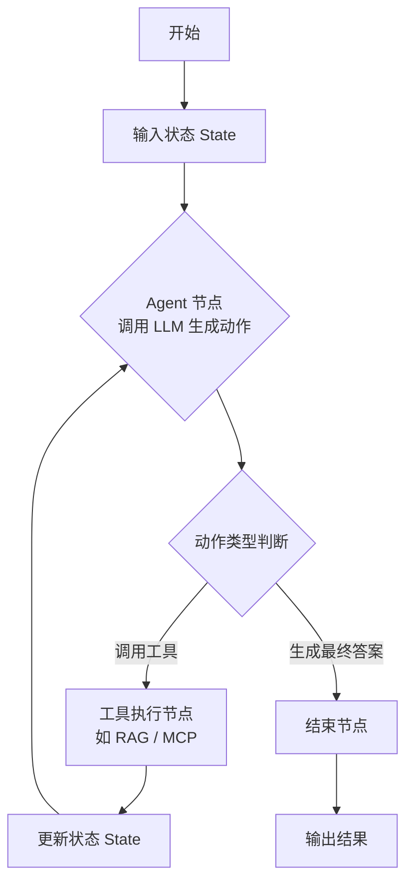

# 06-agent-basics · LangGraph 智能体基础与循环决策

## 🎯 核心目标与应用场景

**核心目标**：利用 LangGraph 构建具备状态记忆与循环推理能力的有状态 Agent，突破传统单次推理的限制，实现复杂任务的动态规划与多步执行。

**应用场景**：
1. **多步推理与纠错**：Agent 在生成答案后，可自动检查结果质量，若发现错误则重新规划执行路径，直至输出正确结果。
2. **多工具协同调用**：同时集成 RAG（检索增强生成）与 MCP（模型上下文协议）服务，让 Agent 在知识检索与外部工具调用之间灵活切换。
3. **多 Agent 分工协作**：例如“研究员”Agent 负责信息收集与整理，“作家”Agent 基于收集到的信息进行内容创作，两者通过共享状态实现高效协作。

## 🧠 技术原理与架构流程图

LangGraph 的核心思想是**有限状态机（Finite State Machine）**。它通过维护一个全局的 `State` 字典，让 Agent 在预定义的 `Node`（节点）之间循环流转。每个节点代表一个处理步骤（如调用 LLM、执行工具、判断条件），节点之间的 `Edge`（边）定义了流转逻辑（如条件分支、循环回退）。这种设计解决了传统“单链条”模型无法处理反馈和复杂分支的问题。



**通俗解释**：
- 整个流程就像是一个“思考-行动-观察”的循环。
- **State** 是 Agent 的“工作记忆”，记录着对话历史、中间结果、错误信息等。
- **Node** 是具体的“行动步骤”，比如“调用大模型思考”、“执行一个搜索工具”。
- **Edge** 是“决策规则”，告诉 Agent 下一步该做什么：如果工具返回了错误，就回到思考节点重新规划；如果答案已经完善，就结束流程。

## 🛠️ 操作方法与执行命令

确保已安装所需依赖（如 `langgraph`, `langchain`, `openai` 等），然后直接运行对应的 Python 脚本即可体验不同功能。

```bash
# 1. 运行一个简单的 LangGraph Agent（单工具循环调用）
python 06-agent-basics/01_simple_langgraph_agent.py

# 2. 运行多 Agent 协作示例（研究员 + 作家）
python 06-agent-basics/04_multi_agent_collaboration.py

# 3. （可选）运行带条件分支的 Agent 示例
python 06-agent-basics/02_conditional_agent.py

# 4. （可选）运行集成 RAG 与 MCP 工具的 Agent
python 06-agent-basics/03_tool_integration_agent.py
```

> 注意：如果脚本依赖环境变量（如 `OPENAI_API_KEY`），请确保已提前设置，或直接在脚本中配置。

## ⚠️ 注意事项与踩坑记录

1. **State 定义必须严格**：LangGraph 的 `State` 是一个 TypedDict，所有节点函数都必须返回与 `State` 结构完全匹配的字典。漏掉字段或类型不匹配会导致运行时错误。
2. **循环深度限制**：默认情况下，LangGraph 允许无限循环，但实际应用中应设置 `max_iterations` 或通过条件边强制终止，否则可能陷入死循环或产生巨额 API 费用。
3. **工具调用异常处理**：当集成外部工具（如 MCP 服务）时，务必在节点内添加 `try-except` 捕获异常，并将错误信息写入 `State`，让 Agent 能够感知并重新规划，而不是直接崩溃。
4. **多 Agent 状态隔离**：在多 Agent 协作场景中，每个 Agent 应拥有独立的子状态，避免互相污染。建议使用 `StateGraph` 的子图（Subgraph）功能进行隔离。