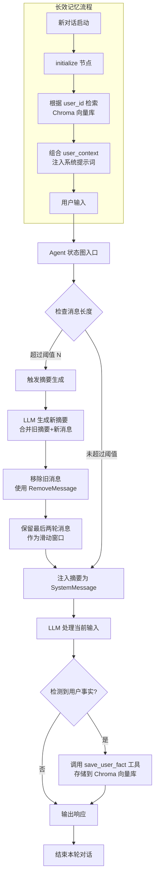

# 07-advanced-memory · 智能体深度记忆与长效认知架构

## 🎯 核心目标与应用场景

**核心目标**：通过摘要记忆和长效用户画像两种机制，解决 AI Agent 在长对话中的 Token 爆炸、注意力稀释和跨会话记忆丢失问题，实现高效、持久的上下文管理。

**应用场景**：
1. **客服机器人**：处理单次长对话（如技术支持、投诉处理），自动压缩历史记录以降低 Token 消耗并保持连贯性。
2. **个性化个人助理**：跨会话记住用户偏好（如编辑器选择、主题设置），在重启后仍能提供定制化服务。
3. **长期项目副手**：在软件开发或研究项目中，持久化存储架构决策、Bug 历史等关键事实，支持多轮协作。

## 🧠 技术原理与架构流程图

### 架构流程图



### 原理通俗解释

- **摘要记忆**：类似人类的“短期记忆压缩”。当对话消息数量超过预设阈值（如 10 条）时，系统自动触发 LLM 生成一份包含历史关键信息的摘要，并删除旧消息（通过 `RemoveMessage` 指令），仅保留最近两轮消息作为“滑动窗口”。这样既避免了 Token 爆炸，又通过摘要维持了上下文连贯性。
- **长效记忆**：类似人类的“长期语义记忆”。Agent 配备一个 `save_user_fact` 工具，在对话中主动提取用户事实（如姓名、偏好）并存储到外部 Chroma 向量数据库。每次新对话启动时，通过 `initialize` 节点根据用户标识检索相关事实，注入系统提示词，实现跨会话的个性化记忆。

## 🛠️ 操作方法与执行命令

### 摘要记忆模块

```bash
# 运行摘要记忆实验代码
python 01_summary_memory.py

# 示例：自定义消息阈值（默认 10 条）
python 01_summary_memory.py --max_messages 5
```

### 长效记忆模块

```bash
# 运行长效记忆实验代码
python 02_long_term_profile.py

# 示例：指定用户 ID 以启用个性化记忆
python 02_long_term_profile.py --user_id "user_123"
```

### 依赖安装

```bash
# 安装所需依赖
pip install langgraph chromadb openai python-dotenv
```

## ⚠️ 注意事项与踩坑记录

1. **摘要生成时机**：确保消息长度阈值设置合理（建议 5-10 条），过小会导致频繁摘要生成增加 API 成本，过大会失去压缩意义。
2. **RemoveMessage 使用**：在 LangGraph 中，必须通过 `add_messages` Reducer 和 `RemoveMessage` 指令才能正确删除状态树中的消息节点，直接修改列表无效。
3. **向量数据库持久化**：Chroma 默认使用内存存储，重启后数据丢失。需配置持久化路径（如 `Chroma(persist_directory="./chroma_db")`）以保持长效记忆。
4. **用户标识一致性**：长效记忆依赖 `user_id` 进行检索，确保每次对话使用相同的标识，否则无法唤醒历史事实。
5. **工具调用权限**：`save_user_fact` 工具需在提示词中明确要求模型主动调用，否则模型可能忽略事实提取。建议添加示例提示：“如果用户提到姓名、偏好等硬事实，请调用 save_user_fact 工具记录。”