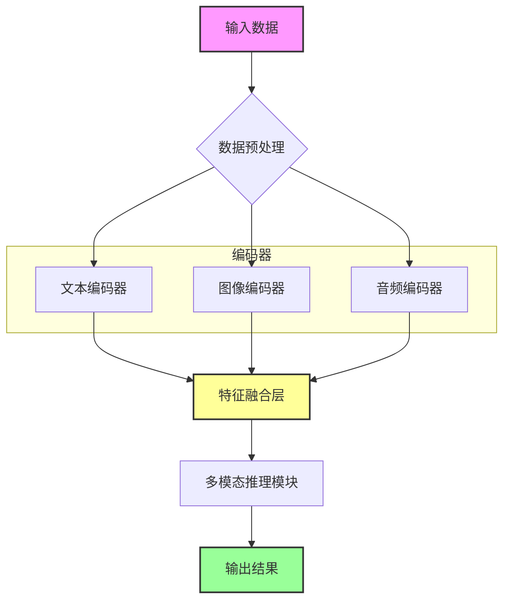

# 08-multimodal · 多模态与视觉识别探索

## 🎯 核心目标与应用场景

**核心目标**：实现多模态数据的统一处理与交互，支持文本、图像、音频等多种数据类型的融合分析与推理。

**应用场景**：
1. **智能问答系统**：结合图像与文本输入，回答关于图片内容的复杂问题（如“图中人物穿什么颜色的衣服？”）。
2. **多模态内容审核**：同时分析文本描述与图像内容，检测违规信息（如广告图片中的敏感文字）。
3. **跨模态检索**：通过文本描述搜索匹配的图像，或通过图像搜索相关文本描述。

## 🧠 技术原理与架构流程图



**原理说明**：系统首先对输入的多模态数据进行预处理（如文本分词、图像缩放、音频重采样），然后分别送入对应的编码器提取特征。文本编码器（如BERT）生成语义向量，图像编码器（如ViT）生成视觉特征，音频编码器（如Wav2Vec2）生成声学特征。这些特征在融合层通过注意力机制或拼接操作进行对齐与整合，最终由多模态推理模块（如Transformer解码器）生成统一的输出结果。

### 🧩 图像与文字 Token 对齐的核心代码剖析
为了让你更加直观地理解大语言模型（LLM）是如何“看见”图片的，我们在本模块下提供了底层的伪代码演示 `multimodal_alignment_demo.py`。
本质上，多模态对齐就是**特征维度的投影与张量的拼接**。核心过程如下：

```python
# 1. 提取视觉特征 (ViT)
# 一张 224x224 的图片被切分成 196 个 Patch，每个 Patch 被编码为 1024 维的 Token
v_tokens = vision_encoder(image)  # Shape: [1, 196, 1024]

# 2. 投影层“翻译” (Projection Adapter)
# 通过线性层或 MLP，将视觉特有的 1024 维特征，强行投射到 LLM 理解的 4096 维空间
aligned_v_tokens = projection_adapter(v_tokens)  # Shape: [1, 196, 4096]

# 3. 获取文本 Token (LLM Embedding)
# 将用户输入的 Prompt (例如长度为 10 个词) 转化为 4096 维词向量
text_embeddings = text_embed(text_ids)  # Shape: [1, 10, 4096]

# 4. 跨模态历史性会师 (Concat)
# 将这 196 个“伪装成文本”的图像 Token，与真实的 10 个文本 Token 拼接到同一个序列中
# 此时 LLM 看到的只是一个长度为 206 的普通高维序列，直接送入 Transformer Decoder 进行自回归预测！
combined_embeddings = torch.cat([aligned_v_tokens, text_embeddings], dim=1) # Shape: [1, 206, 4096]
```

## 🛠️ 操作方法与执行命令

本模块包含原生的多模态对齐底层逻辑演示，以及基于 API 的上层调用实战。

**1. 运行底层图文对齐伪代码演示**
```bash
# 执行我们手写的 PyTorch 跨模态拼接演示
python 08-multimodal/multimodal_alignment_demo.py
# 预期输出: 终端将打印出 196 个视觉 Token 是如何与 10 个文本 Token 拼接到一起送入 LLM 的维度变换过程。
```

**2. 运行大模型 Vision API 测试**
```bash
# 测试调用大模型 API 解析在线图像（如识别 Google Logo）
python 08-multimodal/01_test_vision.py
# 预期输出: AI 会返回对图片的颜色和文字的描述。
```

## ⚠️ 注意事项与踩坑记录

1. **数据对齐问题**：不同模态的数据采样率可能不一致（如视频帧率与音频采样率），务必在预处理阶段统一时间轴，否则会导致特征错位。
2. **显存溢出**：多模态模型参数量大，训练时建议使用梯度累积（`gradient_accumulation_steps`）或混合精度训练（`fp16`）。
3. **编码器版本兼容性**：预训练编码器（如CLIP、BERT）的版本更新可能导致特征维度变化，请锁定`requirements.txt`中的版本号。
4. **跨模态注意力权重初始化**：融合层的注意力权重建议使用Xavier初始化，避免训练初期梯度消失。
5. **音频预处理**：音频文件格式（WAV/MP3）和采样率（16kHz/44.1kHz）需统一，建议使用`librosa`进行重采样。