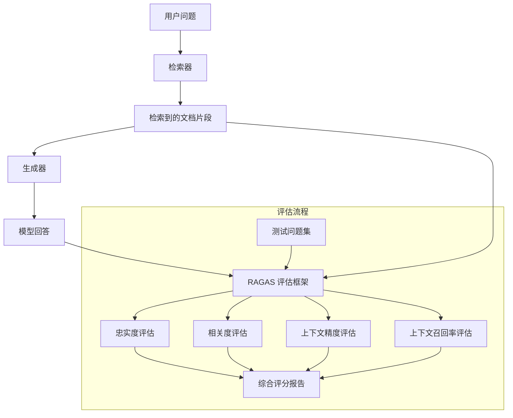

# 09-evaluation · RAGAS 自动化评估与全链路评测

## 🎯 核心目标与应用场景

**核心目标**：科学量化 RAG（检索增强生成）系统的性能，通过自动化评估框架发现并诊断模型幻觉与检索缺失问题。

**具体应用场景**：
1. **RAG 系统质量监控**：在生产环境中持续评估问答系统的忠实度与相关度，及时发现模型输出与知识库的偏差。
2. **检索器性能调优**：通过上下文精度与召回率指标，量化不同检索策略（如向量检索、混合检索）对最终回答质量的影响。
3. **模型对比与选型**：使用 LLM-as-a-judge 方法，让强模型（如 GPT-4）为弱模型（如开源小模型）的回答打分，辅助模型选型决策。

## 🧠 技术原理与架构流程图



**原理通俗解释**：
RAGAS 评估框架的核心思想是**量化分析**。它利用强模型的逻辑推理能力，对 RAG 系统输出的文本与背景知识库进行语义比对。具体来说：
- **忠实度（Faithfulness）**：检查模型回答是否完全基于检索到的文档，是否存在凭空编造的内容（即幻觉）。
- **相关度（Relevance）**：评估回答是否直接针对用户问题，而非答非所问。
- **上下文精度（Context Precision）**：衡量检索到的文档片段中，有多少是真正对回答有用的。
- **上下文召回率（Context Recall）**：衡量回答所需的关键信息，是否都被检索器成功召回。

通过这四个维度的综合评分，可以系统性地诊断 RAG 系统的薄弱环节。

## 🛠️ 操作方法与执行命令

假设模块内包含 `02_real_ragas.py` 文件，运行评估的命令如下：

```bash
# 运行 RAGAS 评估脚本
python 09-evaluation/02_real_ragas.py

# 如需指定自定义测试集（JSON 格式）
python 09-evaluation/02_real_ragas.py --test-set ./data/custom_test_set.json

# 如需调整评估的裁判模型（默认使用 GPT-4）
python 09-evaluation/02_real_ragas.py --judge-model gpt-3.5-turbo
```

## ⚠️ 注意事项与踩坑记录

1. **API 密钥与成本**：RAGAS 框架依赖 LLM-as-a-judge，需要配置 OpenAI 或其他大模型 API 密钥。评估大量样本时，API 调用费用可能较高，建议先在小规模测试集上验证。
2. **裁判模型偏见**：强模型作为裁判时，可能存在对自身输出风格的偏好（如偏好更长或更结构化的回答）。建议使用多个裁判模型交叉验证，或对裁判模型进行校准。
3. **测试集构建质量**：自动化测试集需要包含标准答案（Ground Truth），且问题应覆盖不同难度和类型。如果测试集质量差（如问题模糊、答案不唯一），评估结果将失去参考价值。
4. **指标解释需谨慎**：四个指标并非独立，例如低忠实度可能源于低上下文召回率（检索器没找到正确信息，模型被迫编造）。分析时需结合具体案例，而非只看总分。