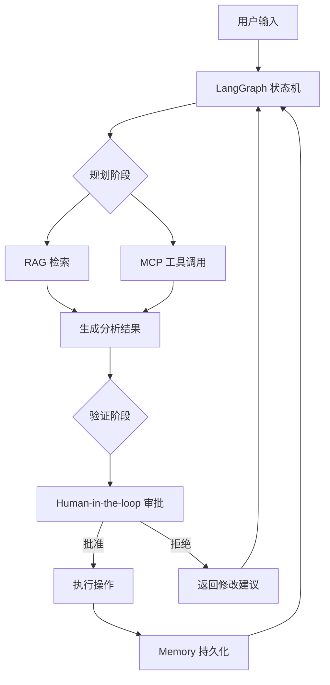

## 🎯 核心目标与应用场景

**核心目标**：构建一个端到端的生产级代码库智能辅助工具，通过集成 RAG、MCP、LangGraph 和 Memory 技术，实现代码库的智能问答、自动化分析与安全操作。

**应用场景**：
1. **代码库智能问答**：开发者可以针对特定代码库提出自然语言问题（如“查找所有未使用的导入”），系统自动检索并生成答案。
2. **自动化代码审查与修改**：在人工审批后，自动执行代码重构、依赖更新或 Bug 修复等操作，减少重复劳动。
3. **长对话上下文维护**：支持跨会话的持久化记忆，在多次交互中保持对项目结构和历史操作的认知。

## 🧠 技术原理与架构流程图



**原理说明**：系统基于 LangGraph 构建了一个“规划-执行-验证”的闭环状态机。用户输入后，首先进入规划阶段，通过 RAG（检索增强生成）从代码库中获取相关上下文，并利用 MCP（模型上下文协议）调用外部工具（如文件读写、Git 操作）。生成的结果进入验证阶段，通过强制中断点（`interrupt_before`）等待人工审批。只有获得批准后，操作才会真正执行，并将结果存入 Memory 模块，实现跨会话的状态持久化。这种设计确保了高风险操作（如修改代码库）的完全可控。

## 🛠️ 操作方法与执行命令

假设模块文件位于 `projects/repo_sense/assistant_v4_hitl.py`，运行命令如下：

```bash
# 启动端到端生产级助手（包含人机协同审批）
python projects/repo_sense/assistant_v4_hitl.py

# 如果需要指定配置文件或日志级别，可添加参数
python projects/repo_sense/assistant_v4_hitl.py --config config.yaml --log-level INFO

# 在调试模式下运行（跳过部分审批步骤，仅用于测试）
python projects/repo_sense/assistant_v4_hitl.py --debug
```

## ⚠️ 注意事项与踩坑记录

1. **中断点配置**：确保在 LangGraph 的状态机定义中正确设置了 `interrupt_before` 节点，否则高风险操作可能跳过审批直接执行，导致不可逆的代码库修改。
2. **Memory 持久化路径**：默认的 Memory 存储路径可能因操作系统不同而失效（如 Windows 与 Linux 的路径分隔符差异），建议在配置文件中显式指定绝对路径。
3. **MCP 工具权限**：MCP 调用的外部工具（如 Git 命令或文件写入）需要运行用户具有相应权限。在 Docker 或 CI/CD 环境中运行时，务必检查权限设置，避免因权限不足导致操作失败。
4. **长对话上下文溢出**：当对话轮次过多时，Memory 模块可能积累大量历史记录，导致 Token 消耗过高。建议设置最大记忆轮次（如 50 轮）或定期清理过期记忆。