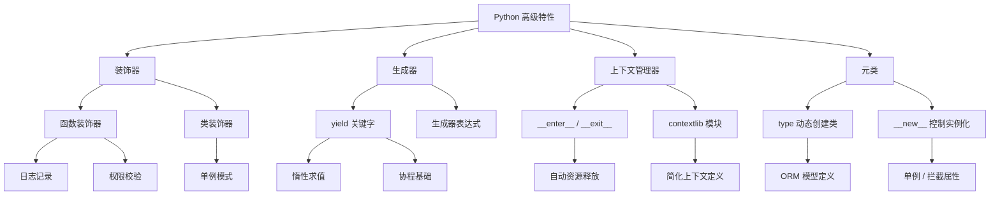

# 11-python-advanced · Python 高级特性与高性能编程

## 🎯 核心目标与应用场景

**核心目标**：通过 Python 高级特性（如装饰器、生成器、上下文管理器、元类等）提升代码的复用性、可读性和执行效率，实现更优雅、更 Pythonic 的编程范式。

**应用场景**：
1. **Web 框架中的路由与权限控制**：利用装饰器为视图函数添加路由注册、用户认证、日志记录等横切关注点。
2. **大数据流式处理**：使用生成器实现惰性求值，逐行处理 GB 级日志文件或数据流，避免内存溢出。
3. **资源自动管理与上下文封装**：通过上下文管理器（`with` 语句）自动管理数据库连接、文件句柄、锁等资源的获取与释放。

## 🧠 技术原理与架构流程图



**原理通俗解释**：
- **装饰器**：本质是一个高阶函数，它接收一个函数或类作为参数，并返回一个增强后的版本。常用于在不修改原函数代码的情况下，为其添加额外功能（如计时、缓存、权限检查）。
- **生成器**：使用 `yield` 关键字的函数，每次调用 `next()` 时暂停并返回一个值，下次从暂停处继续。这使得它可以按需生成数据，极大节省内存。
- **上下文管理器**：实现了 `__enter__` 和 `__exit__` 方法的对象，配合 `with` 语句使用。无论代码块是否抛出异常，`__exit__` 都会执行，确保资源被正确释放。
- **元类**：类的类（默认是 `type`）。通过自定义元类，可以在类被创建时拦截并修改类的定义，常用于 ORM、API 校验框架等场景。

## 🛠️ 操作方法与执行命令

假设项目结构如下：
```
11-python-advanced/
├── decorators/
│   ├── timer.py
│   └── auth.py
├── generators/
│   └── file_reader.py
├── context_managers/
│   └── db_connector.py
├── metaclasses/
│   └── singleton.py
└── main.py
```

**运行示例命令**：

```bash
# 1. 运行装饰器示例（计时装饰器）
python -m decorators.timer

# 2. 运行生成器示例（逐行读取大文件）
python -m generators.file_reader --filepath /path/to/large.log

# 3. 运行上下文管理器示例（模拟数据库连接）
python -m context_managers.db_connector

# 4. 运行元类示例（单例模式验证）
python -m metaclasses.singleton

# 5. 运行主入口，展示所有高级特性
python main.py
```

## ⚠️ 注意事项与踩坑记录

1. **装饰器顺序影响**：多个装饰器堆叠时，执行顺序是从下往上（离函数定义最近的先执行）。例如 `@auth @log` 会先执行 `log` 再执行 `auth`。
2. **生成器只能遍历一次**：生成器对象是迭代器，遍历完所有元素后即耗尽。如需多次使用，请转换为列表（注意内存开销）或重新创建生成器。
3. **上下文管理器异常处理**：`__exit__` 方法接收 `exc_type, exc_val, exc_tb` 三个参数。如果返回 `True`，则会抑制异常（不向外抛出），需谨慎使用。
4. **元类冲突**：如果一个类同时继承多个使用了不同元类的父类，会引发 `TypeError: metaclass conflict`。解决方案是创建一个新的元类，同时继承冲突的元类。
5. **Python 版本兼容**：部分高级特性（如 `@dataclass`、`match` 语句）仅在 Python 3.7+ 或 3.10+ 中可用。请确保运行环境版本符合要求。