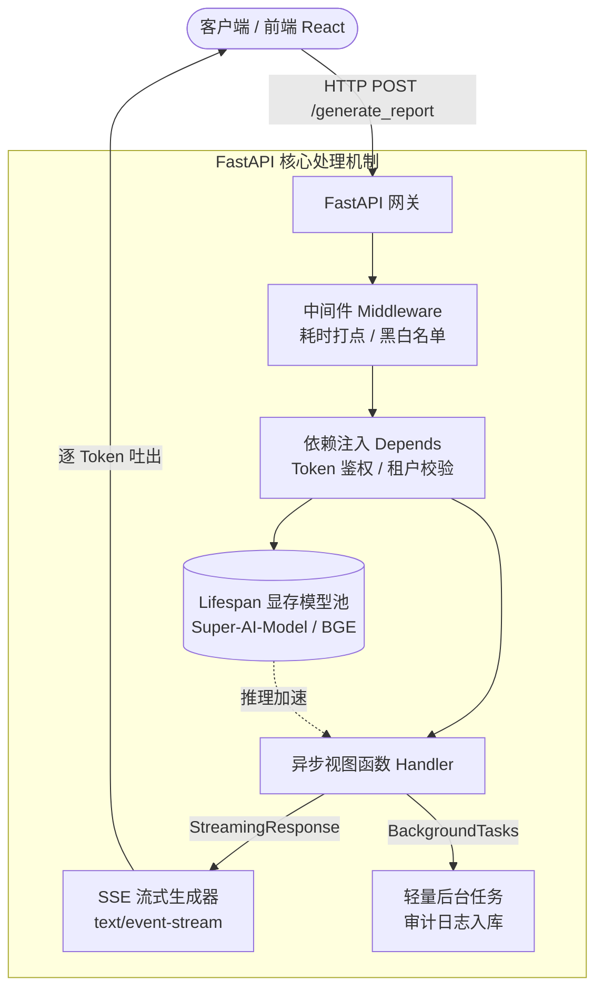

# 12-fastapi-advanced · 大模型高性能 API 网关与 SSE 流式输出

## 🎯 核心目标与应用场景

**核心目标**：掌握将大模型/Agent 封装为生产级高并发 API 服务的工程底座，重点攻克大模型显存生命周期挂载、实时打字机流式推流（SSE）、请求鉴权与依赖树治理。

**为什么 AI 工程师必须学 FastAPI**：
在本地跑 `agent.invoke()` 只是单机玩具。在企业级生产环境中，大模型推理需要面向数千并发用户，传统的同步 Web 框架（如 Flask/Django）会因为 LLM 漫长的生成等待（几秒到几十秒）直接耗尽线程池崩溃。FastAPI 基于 `asyncio` 与 Starlette，是目前对接大模型、实现非阻塞 I/O 和流式长连接的最佳基础设施。

**真实应用场景**：
1. **AI 对话打字机推流 (SSE / WebSocket)**：通过异步生成器实现类似 ChatGPT 的逐 Token 流式响应，将用户感知的首字延迟从 15 秒降低到 300 毫秒。
2. **大模型服务 Lifespan 显存挂载**：在服务启动时一次性将几十 GB 的本地大模型或 Embedding 检索模型载入 GPU 显存，服务停机时优雅释放，防止显存泄漏。
3. **企业级 API 鉴权与审计中间件**：无侵入拦截每个 Agent 请求，完成 API Key 鉴权、Token 计费统计以及请求耗时全链路追踪。

---

## 🧠 技术原理与架构流程图

FastAPI 的核心优势在于原生的异步事件循环机制、基于 Pydantic 的严苛参数校验与高效的依赖注入系统（Dependency Injection）。



**原理解析**：
- **Lifespan 机制**：替代已废弃的 `@app.on_event("startup")`，使用 Python 异步上下文管理器（`@asynccontextmanager`），确保模型在服务接受流量前完成预热，关闭时执行确定性的显存垃圾回收。
- **StreamingResponse (SSE)**：利用 HTTP 分块传输编码（Chunked Transfer Encoding），异步函数使用 `async def generator(): yield chunk` 持续推送内容，连接不中断，避免客户端超时。
- **嵌套 Depends 树**：依赖项以 DAG（有向无环图）方式执行，解耦鉴权、会话提取与数据库会话生命周期。

---

## 🛠️ 操作方法与执行命令

本章节提供了完整的 AI API 服务示例与单元测试，所有命令均可在本地即时运行：

```bash
# 1. 激活虚拟环境并安装核心依赖
source venv/bin/activate
pip install fastapi uvicorn[standard] httpx pydantic websockets

# 2. 启动 AI 高性能网关服务（支持 Lifespan 模型预热与打字机流式输出）
uvicorn 12-fastapi-advanced.app:app --reload --port 8080

# 3. 在新终端测试打字机流式输出 (SSE 流式接口)
curl -N -X POST http://127.0.0.1:8080/generate_report \
  -H "Authorization: Bearer secret_admin_token" \
  -H "Content-Type: application/json" \
  -d '{"prompt": "请深度解析 Agent 架构", "stream": true}'

# 4. 测试鉴权拦截（使用错误 Token）
curl -i http://127.0.0.1:8080/admin_dashboard \
  -H "Authorization: Bearer invalid_token"

# 5. 启动 WebSocket 双向交互与分片上传演示（可选）
python 12-fastapi-advanced/more_fastapi_examples.py

# 6. 执行全套接口自动化测试
pytest 12-fastapi-advanced/test_fastapi_examples.py -v
```

---

## ⚠️ 注意事项与踩坑记录

1. **流式推流阻塞事件循环**：
   - ❌ **致命坑**：在 `async def` 路由中调用同步阻塞的大模型 SDK（如老版本 `openai.ChatCompletion.create`）或使用同步 `time.sleep()`，会导致单用户的等待直接卡死整个服务的所有其他并发请求！
   - ✅ **解决方案**：在流式生成中必须使用原生异步库（如 `AsyncOpenAI`、`asyncio.sleep`），或使用 `run_in_threadpool` 将阻塞同步代码移至线程池。
2. **SSE 响应格式与编码**：
   - 流式传输中文字符时，若直接使用 JSON 序列化，默认会将中文转为 `\u4e2d\u6587` Unicode 编码。必须设置 `json.dumps(..., ensure_ascii=False)`，并在响应头明确声明 `media_type="text/event-stream; charset=utf-8"`。
3. **中间件中读取 Body 的深坑**：
   - 中间件若直接调用 `await request.body()`，由于 Request 流只能被读取一次，后续路由处理函数读取 Body 时会报 EOF 或挂起。若需读取，必须重新构造包装 Request 流。