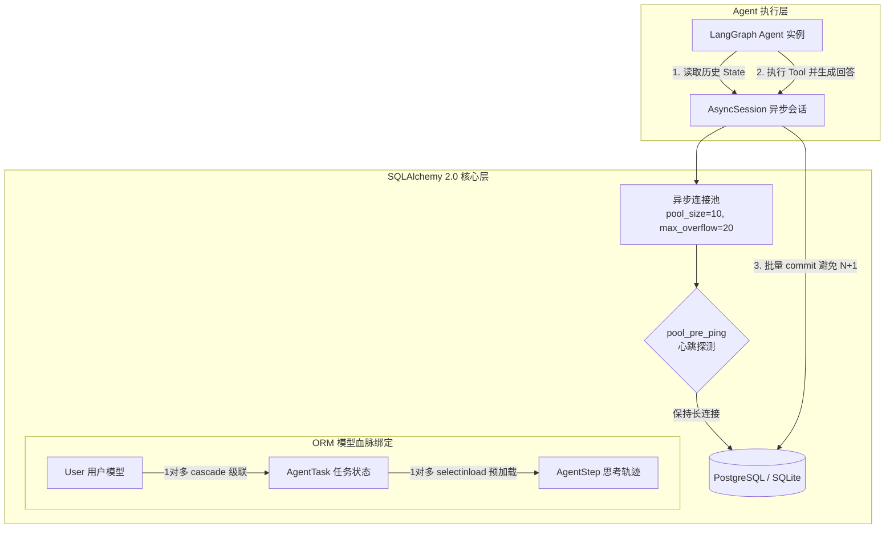

# 13-sqlalchemy-advanced · 智能体状态持久化与用户记忆资产

## 🎯 核心目标与应用场景

**核心目标**：掌握在企业级生产环境中，如何利用 SQLAlchemy 2.0 异步 ORM 构建坚固的数据底座，实现 Agent 对话状态持久化（Checkpoint）、Token 消耗账单审计与长效记忆资产管理。

**为什么 AI 工程师必须学 SQLAlchemy ORM**：
向量数据库（ChromaDB/FAISS）只负责语义相似度检索，它**无法**代替关系型数据库！真实企业中：
- 用户的历史对话树、Human-in-the-loop 审批单、每位用户的 Token 配额与账单，都必须依赖 ACID 强一致性的关系型数据库；
- 大模型 Agent 的状态机如果只放在内存里，服务重启或崩溃时所有上下文立即灰飞烟灭。生产级 Agent 必须通过异步 ORM 实时落盘。

**真实应用场景**：
1. **Agent 思考轨迹与 Checkpoint 持久化**：将 LangGraph 的状态快照（State Snapshot）存入 PostgreSQL/SQLite，支持多会话隔离、历史步骤回溯与人机审批状态挂起。
2. **多租户与 Token 账单精准记账**：严格建立 User -> Conversation -> Message -> TokenCost 级联关系，精准记录每次 Tool 调用和 LLM 生成的花费。
3. **高并发连接池防雪崩**：应对成百上千个并发 Agent 实例同时读写数据库时的连接耗尽（Connection Pool Starvation）问题。

---

## 🧠 技术原理与架构流程图

本模块采用 SQLAlchemy 2.0 声明式异步规范（`DeclarativeBase` + `Mapped` 类型安全映射）与异步连接池引擎。



**原理解析**：
- **`pool_pre_ping=True` 救命配置**：大模型生成可能耗时十几秒到数分钟，期间数据库连接处于闲置状态。若无心跳检测，数据库服务端断开连接后，Agent 再次写入时会报致命的 `MySQL server has gone away`。开启此参数会在借用连接前执行轻量探活。
- **避免 N+1 查询陷阱**：在查询用户及其名下所有 Agent 任务历史时，传统懒加载（Lazy Load）会导致发射成百上千次 SQL 往返。本模块演示使用 `selectinload` 与 `joinedload` 实现单次往返批量加载。
- **事务与级联孤立清理 (`cascade='all, delete-orphan'`)**：当用户注销或清空会话时，其名下的所有 Agent 轨迹记录被原子性自动清除，防止垃圾数据膨胀。

---

## 🛠️ 操作方法与执行命令

本模块包含完整的异步 ORM 演练代码与数据库迁移指南：

```bash
# 1. 激活虚拟环境并安装核心依赖
source venv/bin/activate
pip install sqlalchemy aiosqlite alembic

# 2. 运行高阶 ORM 实战（包含连接池管理、级联绑定、批量写入与 N+1 优化演示）
python 13-sqlalchemy-advanced/advanced_orm.py

# 3. 查看生产级数据库结构版本迁移指南 (Alembic)
cat 13-sqlalchemy-advanced/ALEMBIC_GUIDE.md

# 4. 初始化 Alembic 迁移仓库（在生产环境中推荐）
alembic init -t async migrations
```

---

## ⚠️ 注意事项与踩坑记录

1. **异步驱动选择错误**：
   - ❌ **致命坑**：配置 `DATABASE_URL = "sqlite:///demo.db"` 并传入 `create_async_engine`，会直接报 `ValueError: Expected async driver`。
   - ✅ **解决方案**：必须在驱动名前加异步前缀，例如 SQLite 必须是 `sqlite+aiosqlite:///...`，PostgreSQL 必须是 `postgresql+asyncpg://...`。
2. **会话生命周期泄露**：
   - ❌ 严禁把 `AsyncSession` 当作全局变量跨协程共享！
   - ✅ 必须使用 `async with AsyncSessionLocal() as session:` 模式，随用随销毁，确保连接正确归还池中。
3. **`expire_on_commit=False` 必要性**：
   - 默认配置下，`session.commit()` 会使所有对象属性失效。在异步代码中，随后访问对象属性（如 `task.id`）会触发隐式同步 I/O，导致异步报错。初始化会话工厂时务必显式指定 `expire_on_commit=False`。