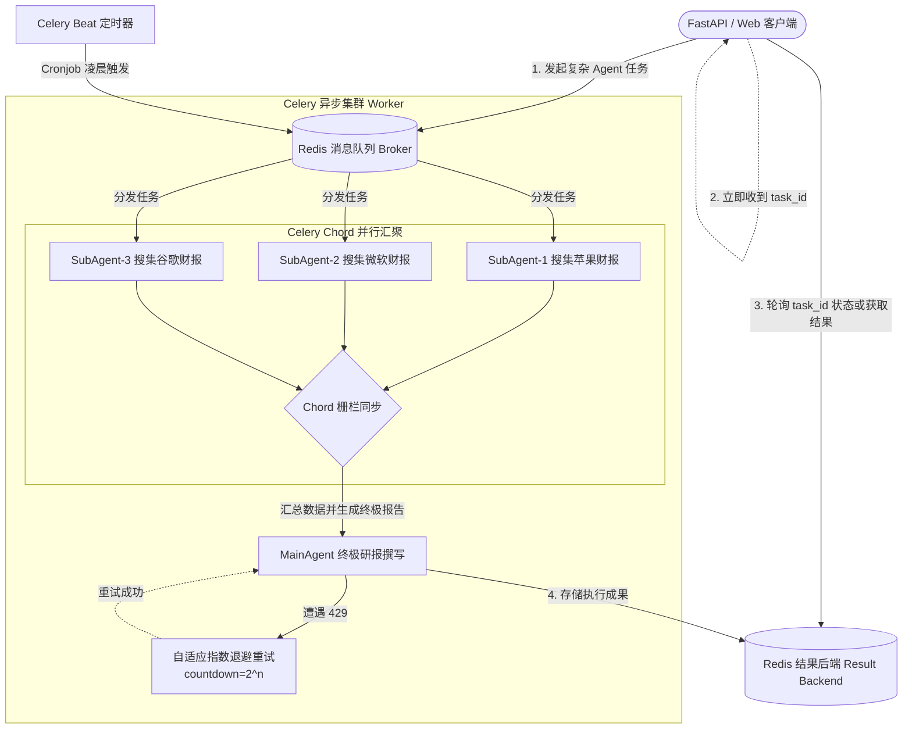

# 14-celery-advanced · 大模型长耗时任务解耦与多 Agent 分布式编排

## 🎯 核心目标与应用场景

**核心目标**：利用分布式任务队列 Celery + Redis，攻克大模型推理与复杂 Agent 系统的长耗时痛点，实现任务异步解耦、429 限流自适应指数退避、多 SubAgent 并行编排（Map-Reduce）与定时知识库自动索引。

**为什么 AI 工程师必须学 Celery 异步队列**：
在企业级场景下，复杂的 Multi-Agent 工作流（如全网多源搜集、万字深度研报生成、代码沙箱构建）通常需要耗费 **30 秒至 10 分钟**。
- 如果将这种超长推理直接放在 HTTP 请求线程里，前端和网关（Nginx/Cloudflare）必然发生 504 Gateway Timeout 崩溃；
- 同时，外部大模型 API（如 DeepSeek/OpenAI）极易在高并发下报 `429 Too Many Requests`，同步请求直接抛错失败，用户体验灾难。
- Celery 是将 AI 系统真正推向**高可用、长任务无感执行、异步状态追踪**的工业级标准解法。

**真实应用场景**：
1. **长耗时 Agent 研报生成与异步任务轮询**：用户发起“生成新能源汽车全景研报”，API 瞬间返回 `task_id`，后台 Celery Worker 慢慢思考，前端通过轮询或 WebSocket 获取进度。
2. **多 SubAgent 并行抓取 (Celery Chord Map-Reduce)**：需要同时深度分析苹果、微软、谷歌三家公司财报时，并行调度 3 个 SubAgent 同时搜索分析，完毕后汇聚给 MainAgent 撰写汇总研报。
3. **大模型 API 429 智能指数退避重试**：当大模型报限流或抖动时，Worker 自动以 1s、2s、4s 指数级后撤重试，彻底防止系统雪崩。
4. **定时知识库更新 (Celery Beat Cronjob)**：每天凌晨定时抓取外部知识源，批量切分向量化并更新 FAISS / ChromaDB 向量索引。

---

## 🧠 技术原理与架构流程图

系统采用生产者-消费者架构，结合 Celery 原语（`chain`, `group`, `chord`）实现高阶多智能体异步协同。



**原理解析**：
- **Chord 并行汇聚原语**：`chord([subtask1, subtask2, ...])(callback_task)`，能够以极低开销实现多 SubAgent 并行化处理，并在全部完成后原子性地触发主智能体汇总，极大缩短端到端耗时。
- **自适应指数退避算法 (`countdown = 2 ** self.request.retries`)**：相比固定间隔重试，指数退避能够快速避开大模型的并发波峰，并在降频后平滑恢复。

---

## 🛠️ 操作方法与执行命令

本模块包含开箱即用的 AI 异步任务源码与调度脚本：

```bash
# 1. 激活虚拟环境并安装核心依赖
source venv/bin/activate
pip install celery redis

# 2. 确保本地 Redis 已经启动（作为任务 Broker 与 Result Backend）
# macOS:
brew services start redis
# 或使用 Docker:
# docker run -d -p 6379:6379 redis:7-alpine

# 3. 启动 Celery Worker 监听 AI 任务队列（在独立终端窗口运行）
celery -A 14-celery-advanced.celery_app worker --loglevel=info --concurrency=4

# 4. 运行业务客户端，触发 AI 任务演示（包含 429 智能重试、多 Agent 并行 Chord、向量库同步）
python 14-celery-advanced/tasks.py

# 5. （可选）启动 Celery Beat 定时调度引擎（自动定时执行向量库同步 Cronjob）
celery -A 14-celery-advanced.celery_app beat --loglevel=info
```

---

## ⚠️ 注意事项与踩坑记录

1. **Celery 任务参数序列化限制**：
   - ❌ **致命坑**：向 `@app.task` 传递复杂的 Python 对象（如不可序列化的 `LangChain AgentExecutor` 或数据库会话 `session`），会触发 JSON 序列化失败直接崩溃。
   - ✅ **解决方案**：任务参数只传递纯文本、数字、字典或数据库的主键 ID（如 `task_id: int`），Worker 收到 ID 后在自身进程内重新初始化环境或查询数据。
2. **时区配置对定时任务的影响**：
   - 默认 Celery Beat 使用 UTC 时间，如果不加配置，计划在每天“早上 8:00”同步知识库的任务会在北京时间“下午 16:00”才执行。
   - 必须在 `celery_app.py` 中显式设置 `timezone = 'Asia/Shanghai'`。
3. **并发模型选择 (Prefork vs Gevent)**：
   - 如果 Worker 内部主要调用外部 LLM API（纯网络 I/O 阻塞等待），使用默认的 `prefork` 进程模型会占用过多系统内存。可推荐使用 `--pool=gevent -c 100` 显著提升并发吞吐量。