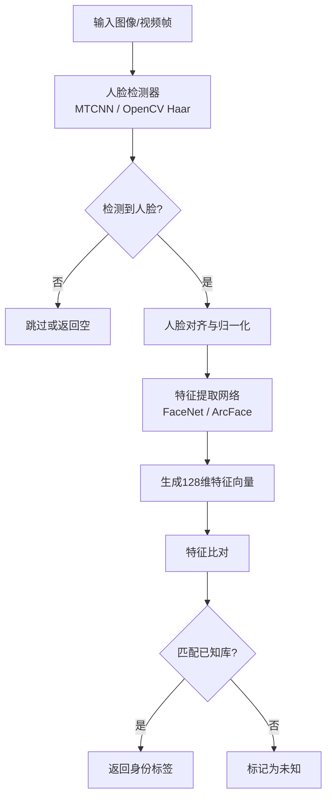

# 16-face-recognition · 生产级人脸识别架构

## 🎯 核心目标与应用场景

**核心目标**：基于人脸识别技术，实现从图像或视频流中检测、提取并比对人脸特征，完成身份验证或人员检索。

**应用场景**：
- **门禁安防系统**：通过摄像头实时抓拍人脸，与授权人员库比对，自动控制门禁开关。
- **考勤签到管理**：在办公或会议场景中，自动识别员工身份并记录考勤时间。
- **智能相册分类**：对个人照片库进行人脸聚类，自动按人物标签整理相册。

## 🧠 技术原理与架构流程图



**原理通俗解释**：
1. **人脸检测**：首先使用 MTCNN 或 OpenCV 的 Haar 级联分类器，从输入图像中定位人脸区域（返回边界框坐标）。
2. **人脸对齐**：检测到的人脸可能倾斜或大小不一，通过关键点（眼睛、鼻子、嘴角）进行仿射变换，将人脸归一化到标准姿态。
3. **特征提取**：将对齐后的人脸图像送入预训练的深度神经网络（如 FaceNet 或 ArcFace），输出一个固定长度的特征向量（通常为128或512维），该向量编码了人脸的独特特征。
4. **特征比对**：将提取的特征向量与数据库中已注册的人脸特征向量进行相似度计算（常用余弦相似度或欧氏距离）。若相似度超过预设阈值，则判定为同一人；否则标记为未知。

### 🧩 核心底层逻辑剖析：判别式特征提取（与 OCR 的同源性）

在传统的判别式视觉任务中，**“定位 (Detection) + 提取 (Extraction)”** 是永恒的黄金架构。我们在 `face_api.py` 中正是利用了这个管线：

```python
# 1. 目标检测 (Detection) - 定位 ROI 区域
# YOLOv8 就像是在海量像素中画框，告诉你“人脸在哪里”。它返回的是 [x_min, y_min, x_max, y_max] 坐标。
# 这与 OCR 技术中的 CTPN 或 DBNet 非常类似，OCR 的第一步也是先用检测模型把“文字行”用框画出来。
bounding_boxes = detector_backend_yolov8(image)

# 2. 特征提取 (Extraction/Embedding) - 将像素转化为向量
# 将抠出来的人脸区域送入 ArcFace 网络。ArcFace 本质是一个 ResNet（卷积神经网络），它去掉了最后的分类头，
# 而是直接输出倒数第二层的全连接层结果：一个 512 维的密集浮点数向量 (Embedding)。
face_vector_512d = model_arcface(cropped_face_image)

# 同理，在 OCR 中（如 CRNN），抠出来的“文字图像”也会被送入 CNN+RNN，提取出一串序列特征，然后预测出到底是哪些字。
```

> 💡 **架构启示**：大模型（如 GPT-4o）是“生成式视觉”，把图片变成 Token 去预测下一个词；而这里的 Face Recognition / OCR 则是“判别式视觉”，通过卷积核强行抽取物理特征向量。在门禁安防、工业质检等要求 **99.99% 确定性**的场景，必须使用这种提取 512 维连续向量计算余弦相似度的架构，而非依赖大模型的“涌现”。

## 🛠️ 操作方法与执行命令

假设项目目录结构如下：
```
16-face-recognition/
├── register.py          # 注册新用户人脸到数据库
├── recognize.py         # 实时识别或单张图片识别
├── utils/
│   ├── face_detector.py # 人脸检测模块
│   └── feature_extractor.py # 特征提取模块
└── data/
    ├── known_faces/     # 已知用户注册照片
    └── embeddings.npy   # 预计算的特征向量库
```

**1. 安装依赖**
```bash
pip install opencv-python tensorflow numpy scikit-learn mtcnn
```

**2. 注册新用户**
```bash
# 将用户照片放入 data/known_faces/<用户名>/ 目录下
# 然后运行注册脚本，提取特征并保存
python register.py --user_dir data/known_faces --output data/embeddings.npy
```

**3. 单张图片识别**
```bash
python recognize.py --image_path test.jpg --embeddings data/embeddings.npy
```

**4. 实时摄像头识别**
```bash
python recognize.py --camera 0 --embeddings data/embeddings.npy
```

## ⚠️ 注意事项与踩坑记录

- **光照与角度影响**：人脸识别对光照条件敏感，强烈侧光或逆光会导致检测失败或特征提取偏差。建议在均匀光照下采集注册照片。
- **阈值调优**：默认相似度阈值（如0.6）可能不适用于所有场景。若误识率高，可调高阈值；若漏识率高，则调低阈值。建议通过验证集进行网格搜索。
- **GPU 内存溢出**：若使用 TensorFlow 或 PyTorch 的 GPU 版本，批量处理大量图片时可能显存不足。可减小 batch_size 或强制使用 CPU（设置环境变量 `CUDA_VISIBLE_DEVICES=-1`）。
- **多人脸重叠**：当画面中多人脸紧密重叠时，检测器可能只返回部分人脸。可尝试调整 MTCNN 的 `min_face_size` 参数或使用更鲁棒的检测器（如 RetinaFace）。
- **特征库更新**：新增用户后，必须重新运行 `register.py` 更新 `embeddings.npy` 文件，否则新用户无法被识别。