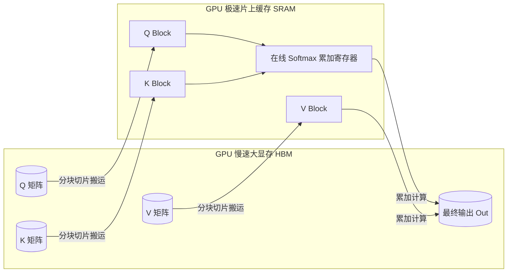

# 17-transformers-basics · Transformer 架构底座与硬件算子开发

## 🎯 核心目标与应用场景

**核心目标**：从零拆解 Transformer 核心数学零件与计算图流转，建立“模型解剖生理学”认知体系（残差连接、注意力机制、Dropout、海量预训练与临床对齐），并深入底层 GPU/NPU 硬件架构，掌握高性能自定义算子开发（OpenAI Triton / Apple Silicon Metal）。

**应用场景**：
1. **大模型架构设计与预训练调参**：精准掌控残差网络梯度穿透、Pre-LN/Post-LN 稳定性、以及海量语料训练中 Dropout 退火关闭策略。
2. **专业领域模型深度对齐（SFT / DPO / RLHF）**：在医疗、金融等严肃领域，将通读文献的 Base 模型驯化为具备门诊诊断思维与伦理合规边界的专家级模型。
3. **极致吞吐底层算子优化（Kernel-Level Optimization）**：突破深度学习框架（PyTorch）显存带宽限制，手写 FlashAttention 分块内核，降低显存开销并将推理吞吐提升数倍。

---

## 🧠 技术原理与架构流程图

### 1. 全景生命周期图：神级医疗专家培养隐喻与技术映射

大模型的演进与一位顶级医学专家的培养过程完全同构：

```mermaid
flowchart TD
    subgraph 生理与神经系统 ["1. 神经与生理底座 (底层架构)"]
        A[残差连接 Residual Connection]:::core -->|骨骼神经通道：梯度无损回传、网络不崩溃| C[深层 Transformer 结构]
        B[Layer Normalization]:::core -->|生理稳态：特征分布归一化| C
        D[Dropout 机制]:::aux -->|防死记硬背练习：海量语料后淡出关闭| C
    end

    subgraph 认知与智商天赋 ["2. 智力与认知中枢 (模型容量)"]
        C --> E[多头注意力 Multi-Head Attention]:::brain
        E -->|大脑容量与逻辑联想| F[超大规模参数容量 7B ~ 671B]:::brain
    end

    subgraph 知识储备阶段 ["3. 万卷通读 (无监督预训练)"]
        F --> G[海量清洗通用与医学语料 Pre-training]:::corpus
        G -->|Next-Token 预测：建立医学常识与世界模型| H[Base 基础大模型]:::corpus
    end

    subgraph 临床与诊断对齐 ["4. 三甲门诊规培 (对齐与强化学习)"]
        H --> I[SFT 监督微调：学习医患门诊对话规范]:::align
        I --> J[DPO/RLHF：专家偏好对齐，戒断危险处方]:::align
        J --> K[RL 推理强化：多步鉴别诊断与思维链推理]:::align
        K --> L[🏅 顶级三甲临床 AI 专家 (Instruct/Reasoning)]:::expert
    end

    classDef core fill:#e1f5fe,stroke:#0288d1,stroke-width:2px;
    classDef aux fill:#fff3e0,stroke:#f57c00,stroke-width:2px;
    classDef brain fill:#ede7f6,stroke:#7e57c2,stroke-width:2px;
    classDef corpus fill:#e8f5e9,stroke:#388e3c,stroke-width:2px;
    classDef align fill:#fce4ec,stroke:#c2185b,stroke-width:2px;
    classDef expert fill:#fffde7,stroke:#fbc02d,stroke-width:3px;
```

---

### 2. 五大核心知识点深度剖析

#### ① 残差连接 (Residual Connection, $x + F(x)$)：骨骼神经系统
- **人话比喻**：相当于专家的骨骼与自主神经系统。它保障一个人能够健康生存、能长成两米高而不至于因供血不足瘫痪崩溃。但骨骼本身并不直接决定你的医术有多高。
- **数学本质**：深层网络若直接连乘 $y = f_L(f_{L-1}(...f_1(x)))$，反向传播根据链式法则 $\frac{\partial y}{\partial x} = \prod W_i$。当权重模长小于 1 时，经过数十层网络梯度会指数级衰减至 0（梯度消失），网络彻底丧失学习能力。
- **直通通道**：残差结构 $x_{l+1} = x_l + F(x_l)$ 在求导时变为：
  $$\frac{\partial x_{l+1}}{\partial x_l} = 1 + \frac{\partial F}{\partial x_l}$$
  式中的常数 **$1$** 相当于一条“超导体专用高速公路”，使深层梯度可以直接穿透百层回传到底层，彻底解决了千亿模型深度扩展（Deep Stacking）的收敛问题。

#### ② Dropout：中小学防死记硬背的偏题练习
- **人话比喻**：在小学初中做题时，为了防止学生只背参考答案的死脑筋，老师故意遮住部分条件做抗干扰训练。但当学生进入医学院乃至顶级三甲医院、面对浩瀚真题海量实践时，这种刻意防死记硬背的题目早已不再需要。
- **演进现状**：
  - 在小模型（如 100M 参数的 BERT）或极小样本分类任务中，Dropout（随机使 10%~20% 神经元失活）能有效防止过拟合。
  - 在现代海量预训练（数十万亿 Token）和长程推理中，模型见识的数据量远超参数量，**过拟合几乎不再发生**。主流大模型（LLaMA-3、DeepSeek、Qwen）在预训练和 SFT 时均将 Dropout 设为 0。现代加速框架（如 Unsloth、FlashAttention）通过移除 Dropout 进一步省去了随机数掩码的显存开销。

#### ③ 注意力机制与模型容量：大脑容量与逻辑联想天赋
- **人话比喻**：决定专家在听到病患描述“右下腹持续钝痛伴反跳痛”时，能否在瞬间联想到“阑尾炎、麦氏点、血常规白细胞升高”之间的逻辑关联。
- **数学机制**：通过查询向量 $Q$（当前关注点）、键向量 $K$（上下文线索）点积计算全局注意力权重，动态加权值向量 $V$：
  $$\text{Attention}(Q, K, V) = \text{softmax}\left(\frac{QK^T}{\sqrt{d_k}}\right)V$$
  模型参数量越大（如 7B 升级至 72B、671B），其隐层维度 $d_{model}$ 与多头数 $num\_heads$ 越充沛，具备的“高维联想空间”与复杂推理潜能就越强。

#### ④ 预训练海量语料：通读万卷医学典籍的世界模型
- **人话比喻**：医学生本科五年将内外妇儿、生理生化、数万篇顶刊文献读破万卷，形成无所不知的医学百科全书。
- **核心职能**：通过无监督自回归 Next-Token-Prediction（下一个词预测），吞吐数以万亿计的全球书籍、网页、医学知识，内化出对物理世界和语言语法的深刻表征（Base 模型），是任何高阶能力的底座。

#### ⑤ SFT、RLHF/DPO 对齐与强化学习推理：三甲规培与真实门诊诊治
- **人话比喻**：光看书的书呆子坐在门诊，可能会直接把整本教科书背给病人听，甚至不懂礼貌、开出致命的毒副相克处方。规培带教与强化实战才是决定他能否成为顶级主治医师的核心。
- **技术跃迁三步曲**：
  1. **SFT (监督微调)**：教模型建立“医患问答规范”角色感，不再答非所问；
  2. **DPO / RLHF (偏好对齐)**：通过专家对比反馈（Chosen vs Rejected），惩罚危险用药、不严谨回答，强化符合医疗伦理的安全回答；
  3. **RL 推理强化 (Reasoning / GRPO)**：借鉴 DeepSeek-R1 强化学习范式，引导模型产生思维链（Chain of Thought），在输出最终诊断前进行深度反思、多病因鉴别与验证推理。

---

### 3. 底层硬件算子开发：Triton 与 Metal 原理

#### 传统 PyTorch 计算的性能瓶颈（内存墙）
在标准的 PyTorch 实现中，执行注意力机制需要：
1. $S = Q \times K^T$（写入 GPU 显存 HBM，显存开销 $O(N^2)$）；
2. $P = \text{softmax}(S)$（从 HBM 读入 $S$，计算完又写回 HBM）；
3. $O = P \times V$（再次从 HBM 读入 $P$，算完写回 HBM）。

**瓶颈**：现代 GPU 的计算核心（SRAM）速度极快，但 HBM 显存带宽极慢，注意力计算绝大部分时间浪费在显存来回搬运上（Memory Bound）。

#### FlashAttention 算子核心思想（Tiling 切块与在线 Softmax）
- **SRAM 片上计算**：将 $Q, K, V$ 按照 `BLOCK_M` 和 `BLOCK_N` 切块，分批载入 GPU 极速的片上缓存（SRAM）；
- **Online Softmax**：利用 Safe Softmax 的数学递推性质，在 SRAM 中累加当前块的最大值与归一化分母，直接算出中间累加值，**全程无需把 $N \times N$ 的注意力大矩阵写入 HBM**！



---

## 🛠️ 操作方法与执行命令

按以下顺序执行各阶段实验脚本，由浅入深掌握基础原理与算子实现：

### 阶段一：Transformer 基础零件与词表感知
**1. 体验 Tokenizer 文本分词与编码截断**
```bash
python 17-transformers-basics/01_tokenizer_basics.py
```
**2. 运行 Embedding 向量检索相似度实验**
```bash
python 17-transformers-basics/02_embedding_rag.py
```
**3. 运行本地小型开源大模型离线推理**
```bash
python 17-transformers-basics/03_local_llm_inference.py
```
**4. 验证注意力机制 (Q/K/V 点积与打分权重)**
```bash
python 17-transformers-basics/04_attention_basics.py
```
**5. 验证 RoPE 旋转位置编码与绝对位置编码**
```bash
python 17-transformers-basics/05_positional_encoding.py
```

### 阶段二：组装 Transformer Block 与残差骨骼
**6. 完整组装含残差连接与 LayerNorm 的 Encoder 算子**
```bash
python 17-transformers-basics/06_transformer_block.py
```
**7. 运行 LoRA 低秩参数高效微调原理代码**
```bash
python 17-transformers-basics/07_lora_finetuning.py
```
**8. 体验推理时 KV Cache 加速机制（自回归步进避免冗余计算）**
```bash
python 17-transformers-basics/08_kv_cache_inference.py
```

### 阶段三：对齐技术与推理生成
**9. 体验 SFT、RLHF 与 DPO 偏好对齐全流程**
```bash
python 17-transformers-basics/14_rlhf_dpo_alignment.py
```
**10. 体验大模型 Logits 约束与结构化 JSON 强制输出**
```bash
python 17-transformers-basics/15_structured_output_logits.py
```

### 阶段四：硬件底层算子开发 (Operator Development)
**11. 在 Apple Silicon Mac 上运行 Metal GPU 加速注意力算子 (基于 Taichi JIT)**
```bash
python 17-transformers-basics/17_mac_metal_attention.py
```
**12. 在 Linux/Nvidia GPU 环境运行 Triton 编写的 FlashAttention 算子**
```bash
python 17-transformers-basics/17_triton_attention_operator.py
```

---

## ⚠️ 注意事项与踩坑记录

1. **残差连接必须直通加和（Post-LN vs Pre-LN）**：
   - 原始经典 Transformer（Post-LN）形式为 `Norm(x + F(x))`，在网络加深时未经归一化的残差直接参与累加，容易造成浅层梯度发散，必须配合学习率预热（Warmup）；
   - 现代主流架构（LLaMA/Qwen/DeepSeek）普遍采用 **Pre-LN** 或 **RMSNorm**，形式为 `x + F(Norm(x))`，残差通道完全无阻碍直通，百层深网训练极为平稳。
2. **Dropout 在训练与推理阶段的模式切换**：
   - 在模型进行前向推理评估时，必须显式调用 `model.eval()`；否则随机丢弃神经元会导致相同 Prompt 输出产生非预期波动。
   - 大模型微调时若开启 Dropout，不仅损害生成一致性，还会破坏 FlashAttention 等融合算子的优化效果，建议直接设为 `0.0`。
3. **Triton 算子平台的硬件边界**：
   - `17_triton_attention_operator.py` 强依赖 Nvidia CUDA 运行环境；
   - 在 macOS (Apple Silicon M系列) 上，请直接使用 `17_mac_metal_attention.py`，它基于 Taichi 编译器直接生成 Apple Metal 底层着色器指令。
4. **FlashAttention 切块大小与硬件 SRAM 容量匹配**：
   - 在 Triton 算子编写中，`BLOCK_M` 和 `BLOCK_N`（通常取 64 或 128）不能任意设定；若设置过大会超出 GPU SM 核心的 Shared Memory (SRAM) 上限，导致内核编译报错或寄存器溢出（Register Spilling）。
5. **对齐训练防“灾难性遗忘”**：
   - 在医疗垂直领域做 SFT 和 DPO 时，若纯粹使用单一专业问答数据，模型往往会丧失通用常识（即灾难性遗忘）。工业界通用解法是在微调数据集中混合 10%~20% 的通用高质量中英混合指令集。