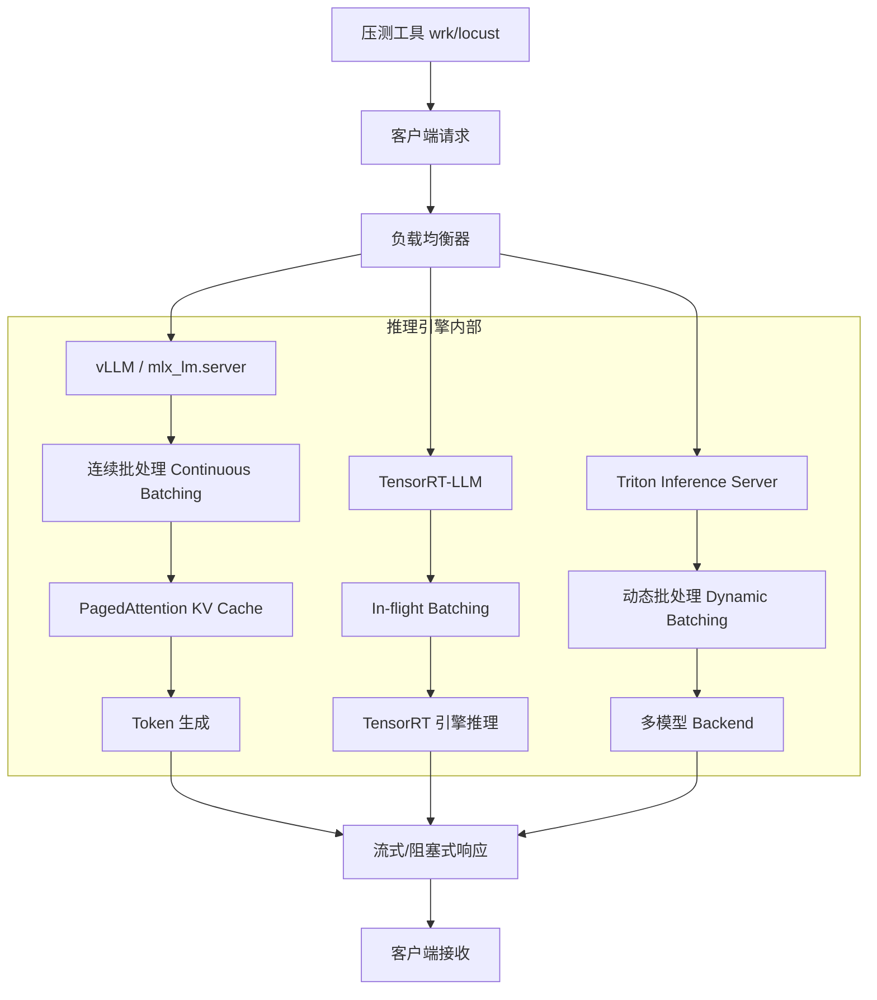

# 18-inference-serving · 大模型高性能推理服务与高并发压测 (vLLM / Triton)

## 🎯 核心目标与应用场景

**核心目标**：将大模型从本地实验环境推向生产环境，实现高吞吐量、低延迟和资源利用率的最大化。

**具体应用场景**：
1. **在线推理服务**：部署大语言模型作为 REST API 服务，支持实时对话、文本生成等业务场景，如智能客服、内容创作助手。
2. **高并发压力测试**：使用异步压测工具模拟多用户并发请求，评估服务端在连续批处理（Continuous Batching）下的吞吐量（QPS）和延迟抖动。
3. **模型量化与优化部署**：通过 AWQ、GPTQ 等量化技术压缩模型体积，结合 TensorRT-LLM 或 Triton Inference Server 实现多模型混合部署，降低推理成本。

## 🧠 技术原理与架构流程图



**原理通俗解释**：
- **连续批处理（Continuous Batching）**：传统批处理需等待所有请求完成才返回，而连续批处理允许新请求动态加入正在进行的批次，极大提升 GPU 利用率。vLLM 通过 PagedAttention 机制将 KV Cache 分页管理，避免显存碎片，支持更大并发。
- **In-flight Batching**：TensorRT-LLM 在推理过程中动态调度请求，允许不同请求处于解码的不同阶段，最大化计算吞吐。
- **动态批处理**：Triton Inference Server 自动将短时间内的多个请求合并为批次，减少模型加载和调度开销，适合多模型混合部署场景。

## 🛠️ 操作方法与执行命令

### 1. 启动 vLLM 推理服务
```bash
# 安装 vLLM
pip install vllm

# 启动 API Server（以 Qwen2.5-0.5B-Instruct 为例）
python -m vllm.entrypoints.openai.api_server \
    --model /path/to/Qwen2.5-0.5B-Instruct \
    --port 8000 \
    --max-model-len 4096 \
    --gpu-memory-utilization 0.9
```

### 2. 使用 mlx_lm.server 在 Apple Silicon 上部署
```bash
# 启动服务（确保模型已本地下载）
python -m mlx_lm.server \
    --model "/Users/mac/.cache/modelscope/models/qwen--Qwen2.5-0.5B-Instruct/snapshots/master" \
    --port 8000
```

### 3. 运行异步压测脚本
```bash
# 安装依赖
pip install aiohttp

# 执行压测（-n 总请求数，-c 并发数，-m 模型名称）
python benchmark_concurrent.py \
    -n 100 \
    -c 20 \
    -m "qwen/Qwen2.5-0.5B-Instruct" \
    --url "http://localhost:8000/v1/chat/completions"
```

### 4. 使用 wrk 进行 HTTP 压测
```bash
# 安装 wrk（macOS: brew install wrk）
wrk -t 4 -c 20 -d 30s \
    --script post.lua \
    http://localhost:8000/v1/chat/completions
```

## ⚠️ 注意事项与踩坑记录

1. **服务未启动导致连接拒绝（Connection Refused）**
   - **表现**：压测脚本瞬间结束，吞吐量 0 QPS。
   - **原因**：本地端口未监听，所有 HTTP 请求被系统秒拒。
   - **解法**：确保先启动 `mlx_lm.server` 或 vLLM 服务，并检查端口是否被占用。

2. **网络环境导致 SSL 握手失败**
   - **表现**：服务端报错 `ConnectError: [SSL: UNEXPECTED_EOF_WHILE_READING]`，压测脚本返回 404 或 Broken Pipe。
   - **原因**：`mlx_lm` 默认懒加载模型，若本地无模型则尝试从 HuggingFace 下载，国内网络 DPI 可能掐断 SSL 握手。
   - **解法**：通过 `modelscope` 库提前下载模型到本地，并指定绝对路径启动服务。
     ```bash
     python download_modelscope.py
     ```

3. **模型名称不匹配导致 401 权限错误**
   - **表现**：压测时抛出 401 报错，服务端尝试请求外网。
   - **原因**：客户端请求体中的 `model` 名称与服务端启动时 `--model` 参数不一致，服务端误以为需要从 HuggingFace 下载。
   - **解法**：通过 `-m` 参数确保客户端模型名称与服务端绝对路径完全一致。

4. **虚假路径触发 HuggingFace 格式校验（HFValidationError）**
   - **表现**：启动服务端瞬间报错 `Repo id must be in the form 'repo_name'`。
   - **原因**：传入的路径在磁盘上不存在，服务端将其解析为在线仓库名，但不符合命名规范。
   - **解法**：使用 ModelScope SDK 下载后打印真实落盘路径，并严格使用该路径启动服务。
     ```bash
     python -m mlx_lm.server --model "/Users/mac/.cache/modelscope/models/qwen--Qwen2.5-0.5B-Instruct/snapshots/master" --port 8000
     ```

5. **生产环境避坑指南**
   - 绝不要依赖模型的网络懒加载，必须确保模型权重提前物化在本地。
   - 对前端传入的参数（如 `model_name`）做好严格校验，防止恶意参数引发引擎崩溃。
   - 将压测机器与计算机器分离，防止压测 I/O 挤占宝贵的 CPU/GPU/MPS 计算资源。