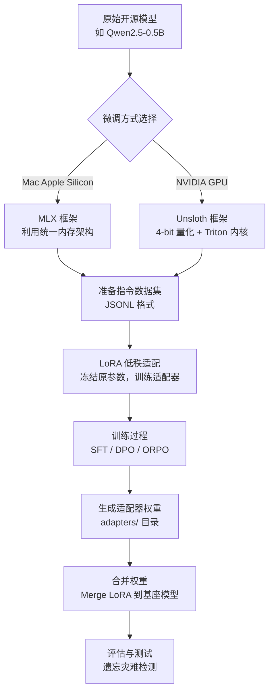

# 19-model-finetuning · 领域大模型微调与 LoRA 适配 (PEFT / QLoRA)

## 🎯 核心目标与应用场景

**核心目标**：不依赖闭源模型的 API，通过使用自己的业务数据（SFT / RLHF）对开源模型进行垂直领域微调，打造私有化专家模型。

**应用场景**：
1. **企业内部知识注入**：将公司内部规范、产品文档等私有知识注入开源模型，使其能够回答特定业务问题（如“星火智能的核心产品有哪些？”）。
2. **输出格式标准化**：通过微调统一模型的回复风格，例如强制输出 JSON 格式、特定语气或固定回复模板，适用于客服、报告生成等场景。
3. **领域专家模型构建**：在医疗、法律、金融等垂直领域，使用高质量指令数据集微调模型，使其具备专业领域的问答能力。

## 🧠 技术原理与架构流程图



**通俗原理解释**：
- **LoRA（低秩适配）**：不修改原始模型的所有参数，而是插入少量可训练的小矩阵（适配器）。训练时只更新这些适配器，大幅降低显存占用和计算量。微调完成后，可以将适配器权重合并回基座模型，或单独保存用于推理。
- **MLX 框架（Mac 专属）**：苹果官方为统一内存架构设计的框架。在 Mac 上，CPU 和 GPU 共享内存，因此可以加载大模型并利用 M 芯片的矩阵加速引擎进行微调，无需 CUDA 显卡。
- **Unsloth 框架（CUDA 环境）**：通过关闭 dropout、使用手写 Triton 内核和 4-bit 量化，将显存占用降低 50%，训练速度提升近一倍。仅适用于 NVIDIA GPU 环境。

## 🛠️ 操作方法与执行命令

### 1. 准备训练数据
```bash
# 运行数据生成脚本，在 data/ 目录下生成 train.jsonl 和 valid.jsonl
python 19-model-finetuning/generate_dataset.py
```

### 2. Mac 环境：使用 MLX 进行 LoRA 微调
```bash
# 注意替换 --model 后的路径为实际下载的模型绝对路径
# 参数解释：--train 开启训练，--iters 训练步数，--num-layers 参与微调的层数
mlx_lm.lora \
    --model "/Users/mac/.cache/modelscope/models/qwen--Qwen2.5-0.5B-Instruct/snapshots/master" \
    --train \
    --data 19-model-finetuning/data \
    --iters 100 \
    --batch-size 2 \
    --num-layers 4 \
    --learning-rate 1e-4
```
*训练完成后，微调权重保存在当前目录的 `adapters/` 文件夹下。*

### 3. 测试微调后的模型生成效果
```bash
# 加载适配器权重并提问
mlx_lm.generate \
    --model "/Users/mac/.cache/modelscope/models/qwen--Qwen2.5-0.5B-Instruct/snapshots/master" \
    --adapter-path adapters \
    --prompt "<|im_start|>user\n你们公司的核心价值观是什么？<|im_end|>\n<|im_start|>assistant\n" \
    --max-tokens 50
```

### 4. CUDA 环境：使用 Unsloth 进行微调
```bash
# 确保在 NVIDIA GPU 环境下运行
python 19-model-finetuning/unsloth_finetune.py \
    --model_name "Qwen/Qwen2.5-0.5B-Instruct" \
    --data_path 19-model-finetuning/data \
    --output_dir ./output \
    --num_train_epochs 3 \
    --per_device_train_batch_size 4 \
    --learning_rate 2e-4
```

## ⚠️ 注意事项与踩坑记录

### 1. MLX 框架版本迭代导致的语法破坏
- **废弃的旧版调用方式**：`python -m mlx_lm.lora` 已被弃用，需改为全局命令 `mlx_lm.lora`。
- **参数命名变更**：旧版参数 `--lora-layers` 在新版中已统一为 `--num-layers`。使用旧参数会报错 `error: unrecognized arguments: --lora-layers 4`。
- **必须显式添加 `--train`**：新版框架默认不执行训练，必须附加 `--train` 参数才会进入反向传播循环。

### 2. 环境隔离与依赖管理
- **Mac 环境禁止安装 Unsloth**：Unsloth 依赖 `bitsandbytes` 和 `xformers`，这些库需要 CUDA 编译器（`nvcc`）。在 Mac 上安装会引发编译错误。
- **锁定依赖版本**：AI 生态工具（MLX、Peft、TRL）版本演进剧烈，一个月前的脚本可能无法运行。生产项目必须提供 `requirements.txt` 并锁定精确版本号。

### 3. 微调 vs RAG 的选择
- **知识注入优先用 RAG**：对于单纯的知识问答（如“星火智能有哪些核心产品”），更推荐使用检索增强生成（RAG）挂载知识库，成本低且易于更新。
- **微调适合格式对齐**：微调（SFT）更适合统一模型的输出格式（如强制输出 JSON）、语气和回复范式，而非注入大量事实性知识。

### 4. 遗忘灾难与评估
- **微调后需测试遗忘灾难**：模型可能在微调后忘记原有能力（如通用知识、推理能力）。务必使用评测集（如 MMLU、C-Eval）进行对比测试。
- **权重合并注意事项**：合并 LoRA 权重时，确保基座模型版本与适配器训练时一致，否则可能导致推理结果异常。