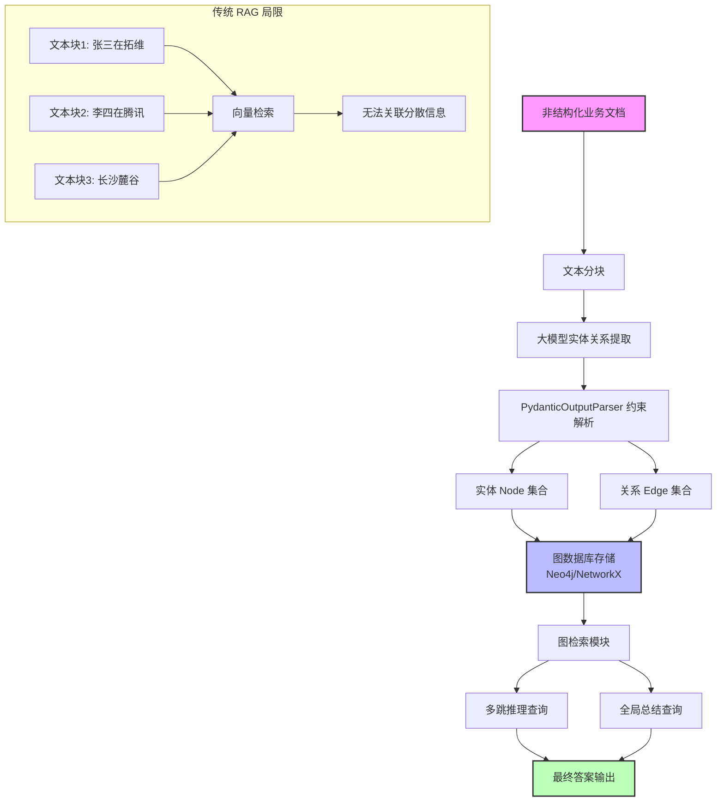

## 🎯 核心目标与应用场景

**核心目标**：通过大模型从非结构化文本中提取实体与关系，构建支持跨文档多跳推理和全局总结的图检索增强生成（GraphRAG）系统，解决传统向量检索无法处理分散信息关联的局限。

**应用场景**：
1. **跨行研报分析**：例如“拓维信息和腾讯在智慧城市领域有哪些共同的客户？”——需要跨越财报中分散的多个段落寻找实体关系链路。
2. **企业风控审查**：基于复杂的资金流转记录，找出隐藏的关联交易和利益输送网络，通过图结构发现异常路径。
3. **医疗病历推理**：结合数百份病历，推断某种罕见并发症的共性前置症状，利用实体关系图谱进行多跳推理。

---

## 🧠 技术原理与架构流程图

### 架构流程图



### 原理通俗解释

传统 RAG 将文本切成几百字的 Chunk 并计算向量相似度。当用户问“张三和李四的公司都在中国吗？”时，由于“张三在拓维”、“李四在腾讯”和“他们在长沙麓谷”分散在三段文本中，向量检索无法跨越碎片建立关联。

GraphRAG 的解法是：
1. **实体提取**：利用大模型阅读文本，识别出人名、公司名、地点等实体（Node）。
2. **关系提取**：识别实体之间的语义关系（Edge），如“张三 WORKS_FOR 拓维信息”、“拓维信息 LOCATED_IN 长沙麓谷”。
3. **图谱构建**：将提取的节点和边存入图数据库，形成知识图谱。
4. **图检索**：查询时通过图遍历算法（如 BFS、最短路径）进行多跳推理，找到分散信息之间的关联路径。

代码中通过 `PydanticOutputParser` 强制大模型输出结构化的 JSON 数据，确保实体和关系的格式一致性，从而支持后续的图存储和检索。

---

## 🛠️ 操作方法与执行命令

### 环境准备
```bash
# 创建并激活虚拟环境
python -m venv venv
source venv/bin/activate  # Linux/Mac
# 或 venv\Scripts\activate  # Windows

# 安装依赖
pip install langchain langchain-openai pydantic python-dotenv
```

### 配置 API 密钥
```bash
# 创建 .env 文件
echo "OPENAI_API_KEY=your_api_key_here" > .env
echo "OPENAI_BASE_URL=https://api.openai.com/v1" >> .env  # 可选，支持第三方 API
```

### 运行实体关系提取
```bash
# 执行提取脚本（自动读取 .env 配置）
python 20-graph-rag/extract_entities.py
```

### 运行图检索查询
```bash
# 执行图检索与推理脚本
python 20-graph-rag/graph_query.py --query "张三和李四的公司都在中国吗？"
```

---

## ⚠️ 注意事项与踩坑记录

### 1. DeepSeek API 的 `response_format` 不兼容问题
- **报错现象**：`openai.BadRequestError: Error code: 400 - ... 'This response_format type is unavailable now'`
- **根本原因**：LangChain 的 `with_structured_output()` 默认调用 OpenAI 的 `json_schema` 强约束 API，但 DeepSeek 等第三方模型服务端暂未支持该原生强结构拦截，导致 API 拒绝请求。
- **解决方案**：采用 `PydanticOutputParser` 替代底层强绑定 API。通过 `parser.get_format_instructions()` 将 JSON 约束转换为自然语言说明塞给大模型，然后使用 `chain = prompt | llm | parser` 将输出字符串本地反序列化。该方案对任意大模型 100% 兼容。

### 2. 实体提取的准确性依赖模型能力
- 弱模型（如 GPT-3.5）可能遗漏关键实体或错误识别关系，建议使用 GPT-4 或同等能力的模型。
- 对于长文本，需合理分块（建议每块 2000-4000 tokens），避免上下文窗口溢出。

### 3. 图数据库选择与性能
- 小规模数据（<10万节点）可使用 NetworkX 内存图，适合原型验证。
- 生产环境建议使用 Neo4j 或 ArangoDB，支持持久化存储和复杂图查询（如 Cypher 语言）。
- 注意图索引的构建，避免全图扫描导致查询延迟。

### 4. 多跳推理的深度控制
- 默认图遍历深度建议设为 2-3 跳，过深可能导致答案发散或性能下降。
- 可通过 `max_depth` 参数控制推理深度，平衡准确性与效率。