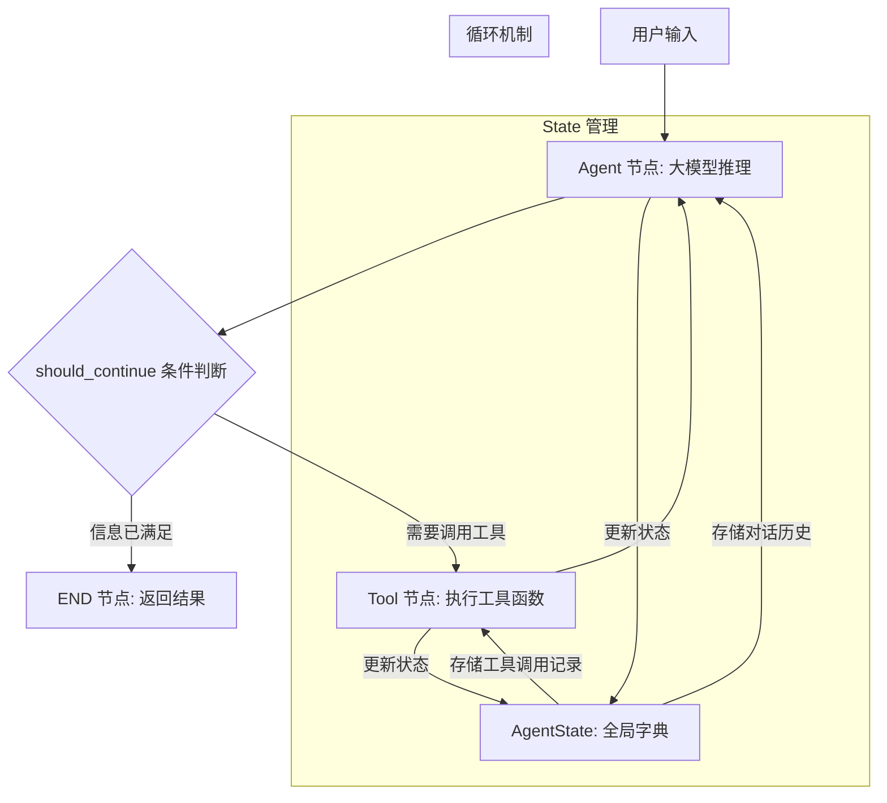

# 21-agent-frameworks · 工业级智能体框架演进 (LangGraph / AutoGen / CrewAI)

## 🎯 核心目标与应用场景

**核心目标**：利用 LangChain 的组件化能力与 LangGraph 的图状态流转机制，构建具备规划、反思、纠错和多步执行能力的生产级有状态 Agent。

**应用场景**：
1. **智能客服系统**：Agent 可自主理解用户问题、调用知识库或 API 查询数据、多轮推理后给出准确答案，并在遇到歧义时主动追问。
2. **自动化数据分析助手**：Agent 接收自然语言查询，自动分解为数据提取、清洗、统计、可视化等子任务，逐步执行并返回结果。
3. **代码审查与修复机器人**：Agent 分析代码仓库中的问题，调用代码分析工具、搜索文档、生成修复建议，并支持人工审批后再执行修改。

---

## 🧠 技术原理与架构流程图

### 架构流程图



### 原理解释

上述流程图展示了 LangGraph 中经典的 **ReAct（思考与行动）** 模式 Agent 的核心架构：

1. **状态记忆（AgentState）**：所有上下文（历史对话、工具调用记录）存储在一个全局字典 `State` 中。通过 `operator.add` 注解，新产生的信息会被不断追加到状态中，使 Agent 具备长程连贯记忆能力。

2. **图节点（Nodes）**：
   - **Agent 节点**：大模型根据当前状态进行推理，决定是否调用工具或直接回答。
   - **Tool 节点**：当大模型决定调用工具时，执行真实的 Python 函数（如查询天气、搜索数据库）。

3. **循环路由（Conditional Edges）**：这是 Agent 自主运行的核心机制。Agent 节点执行完毕后，根据 `should_continue` 函数进行分支判断：
   - 若需要调用工具 → 进入 Tool 节点，获取真实结果后自动返回 Agent 节点继续推理（形成循环图）。
   - 若信息已满足 → 进入 END 节点，结束推理循环并返回结果给用户。

---

## 🛠️ 操作方法与执行命令

### 1. 安装核心依赖

```bash
# 确保安装最新版本（LangGraph 和 LangChain 迭代极快）
pip install -U langchain langgraph langchain-openai python-dotenv
```

### 2. 配置环境变量

创建 `.env` 文件（或直接设置环境变量）：

```bash
# .env 文件内容示例
OPENAI_API_KEY="sk-your-api-key-here"
OPENAI_API_BASE="https://api.openai.com/v1"
MODEL_NAME="gpt-4o"  # 或 "deepseek-chat" 等
```

### 3. 运行基础 Agent 示例

```bash
# 运行基础天气查询 Agent（包含思考→调用工具→再思考的完整周期）
python 20-agent-frameworks/basic_agent.py

# 运行带 Human-in-the-loop 的 Agent（在关键决策点等待人工审批）
python 20-agent-frameworks/hitl_agent.py

# 运行 Supervisor 多 Agent 协作示例
python 20-agent-frameworks/supervisor_agent.py
```

### 4. 调试与测试

```bash
# 启用详细日志输出
LOG_LEVEL=DEBUG python 20-agent-frameworks/basic_agent.py

# 使用流式输出查看每个节点的执行过程
python 20-agent-frameworks/basic_agent.py --stream
```

---

## ⚠️ 注意事项与踩坑记录

### 1. 凭据缺失与加载环境
- **报错**：`openai.OpenAIError: Missing credentials...`
- **原因**：大模型 SDK 初始化时未找到 `OPENAI_API_KEY` 环境变量。
- **解法**：在代码顶部引入 `python-dotenv` 库并调用 `load_dotenv()`，自动读取项目根目录下的 `.env` 文件。避免手动 `export` 的繁琐操作。

### 2. 模型路由拒绝硬编码
- **报错**：`400 BadRequest: The supported API model names are deepseek-v4-pro... but you passed gpt-4o.`
- **原因**：配置了 DeepSeek API 接口（`OPENAI_API_BASE=https://api.deepseek.com/v1`），但代码中硬编码了 `model="gpt-4o"`，导致服务端不识别。
- **解法**：使用 `os.getenv("MODEL_NAME", "default-model")` 动态从环境变量读取模型名称，增强代码在不同提供商之间的可移植性。

### 3. 无状态图的错误读取
- **报错**：`ValueError: No checkpointer set`（调用 `app.get_state(app.config)` 时）
- **原因**：LangGraph 严格约束——`get_state()` 仅允许在配置了持久化记忆机制（如 SQLite/MemorySaver）的图中调用。
- **解法**：对于无状态简单 Agent，不要在代码中调用 `get_state()`。应在 `app.stream(initial_state)` 的迭代循环中动态截获每个节点吐出的最新数据并输出。

### 4. 工具函数返回值格式
- **问题**：工具函数返回的数据格式不符合大模型预期，导致推理循环卡死。
- **解法**：确保工具函数返回字符串或可序列化的字典。使用 `@tool` 装饰器时，明确指定 `return_direct=True` 或 `response_format` 参数。

### 5. 循环深度控制
- **问题**：Agent 陷入无限循环（如反复调用同一个工具）。
- **解法**：在 `StateGraph` 中设置 `recursion_limit` 参数（如 `graph.compile(recursion_limit=10)`），或通过条件边逻辑增加最大迭代次数检查。