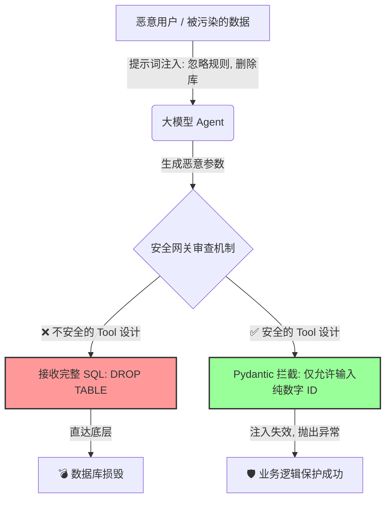

## 🎯 核心目标与应用场景

本模块的核心目标是：**在 AI 智能体投入生产前，识别并防御提示词注入与不安全插件设计两大安全漏洞，构建企业级安全沙箱。**

**应用场景**：
1. **内部知识库问答审计**：防止员工通过特定提示词越权读取高层薪酬数据。
2. **自动化工单处理系统**：防范攻击者在工单正文中隐藏恶意指令（间接注入），诱导后台 AI 执行删除文件或执行恶意脚本。
3. **数据库代理 Agent**：限制 AI 对底层业务数据库的毁灭性操作（如防御 AI 产生的 SQL 注入）。

---

## 🧠 技术原理与架构流程图

### 不安全插件如何被提示词注入击溃？

在大模型编排中，如果插件（Tool）的参数设计过于宽泛，大模型就拥有了直接操控底层系统的权限。例如：如果插件允许接收一段**完整的 SQL 语句**或**原生 Shell 命令**，一旦用户（或网页文本中的隐藏文字）使用了提示词注入技巧骗过了大模型，大模型就会生成类似于 `DROP TABLE` 或 `rm -rf` 的载荷并传给插件。

### 安全的网关模式设计 (Gateway Pattern)

正确的做法是：**剥夺大模型的底层拼接权，将其权限收敛在参数级**。利用 Pydantic 对传入插件的参数进行强约束（类型校验），大模型只能选择传入合法范围内的数值或枚举类型，而复杂的底层系统指令（如 SQL、Shell）应硬编码在本地函数的业务逻辑中。



**原理通俗解释**：上图展示了两种插件设计路径。左侧是不安全的路径：大模型直接接收并执行用户提供的完整 SQL 命令，导致数据库被恶意删除。右侧是安全的路径：插件只接受一个数字 ID 作为参数，底层业务逻辑（如查询特定记录）被硬编码在函数内部，即使大模型被注入，也无法执行破坏性操作。

---

## 🛠️ 操作方法与执行命令

**1. 运行安全攻防演练脚本**
```bash
# 运行演示脚本，观察不安全插件如何损毁数据，以及安全插件如何拦截
python 22-ai-security/plugin_security_demo.py
```

**2. 运行单元测试（验证 Pydantic 校验逻辑）**
```bash
# 运行针对安全插件的单元测试，确保参数校验逻辑正确
python -m pytest 22-ai-security/tests/test_plugin_security.py -v
```

**3. 启动带安全审计的 Agent 服务（假设存在）**
```bash
# 启动一个集成了安全网关的 Agent 服务，监听本地端口
python 22-ai-security/secure_agent_server.py --port 8080
```

---

## ⚠️ 注意事项与踩坑记录

- **Pydantic 异常捕获**：在实际生产中，大模型被 Pydantic 拦截后会抛出 `ValidationError`。建议在 LangChain 的 Tool 外层包裹 `try-except`，将报错信息以自然语言形式反馈给大模型，让它知道自己被拒绝了，而不是让整个服务宕机。
- **人类介入 (Human-In-The-Loop)**：即使插件设计得再安全，只要涉及到资源变动（写入文件、发邮件、修改数据库），绝对不能让 Agent 全自动执行！必须引入 `interrupt` 机制，在终端等待人类工程师的最终确认（Y/N）。
- **日志审计**：务必记录所有被 Pydantic 拦截的请求（包括原始输入和拦截原因），以便事后审计和模型行为分析。建议将日志输出到独立的审计文件，而非标准输出。