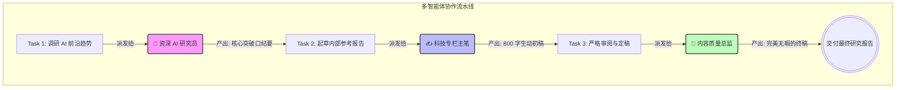

# 22-multi-agent-scale · 多智能体集群编排与规模化调度

## 🎯 核心目标与应用场景

通过多智能体编排框架（如 CrewAI、AutoGen），将复杂业务拆解为多个具有不同专业人设的虚拟数字员工，实现“研究、撰写、审查”等流水线式的高度自治协作。

**应用场景**：
1. **自动化市场调研组**：爬虫 Agent 收集竞品数据 → 分析师 Agent 生成对比报告 → 策略 Agent 给出产品定价建议。
2. **AI 自动化软件工厂**：产品经理提出需求 → 架构师设计图纸 → 程序员编写代码 → 测试员 Review 找 Bug，全链路闭环。
3. **内容黑客流水线**：实时监控网络热点 → 爆款写手生成文案 → 法律审查员排查合规风险 → 发布并监控数据。

---

## 🧠 技术原理与架构流程图

### 多智能体协作原理

本模块基于 CrewAI 框架，模拟了一个虚拟公司的运作。核心概念如下：

1. **Agent（角色）**：定义其 `role`（职位）、`goal`（目标）和 `backstory`（人物背景设定），使大模型严格遵循人设，避免越界行为。
2. **Task（任务）**：定义输入要求和预期输出，并指派给具体的 Agent 执行。
3. **Process（流程）**：默认采用 `Sequential`（串行流程），前一个 Task 的输出自动注入给后一个 Task 的上下文，形成信息接力。

**进阶能力**：通过自定义 `@tool` 为 Agent 赋予“物理手脚”，例如：
- **`Talkweb_Internal_KB_Search`**：允许研究员 Agent 检索内网机密资料（模拟 RAG）。
- **`Save_Report_To_File`**：允许写手 Agent 自动将 Markdown 文件落盘保存。



---

## 🛠️ 操作方法与执行命令

### 1. 安装 CrewAI 生态依赖

```bash
# 由于网络或依赖问题，强烈建议使用国内源
pip install crewai crewai-tools -i https://pypi.tuna.tsinghua.edu.cn/simple/
```

### 2. 启动基础协作流程（纯推理）

```bash
# 启动该脚本，在终端中观察三个 Agent 的信息交接过程
python 21-multi-agent-scale/crewai_demo.py
```

### 3. 启动高阶工具流协作（内网检索 + 文件落盘）

```bash
# 观察 Agent 如何自主判断时机，去调用 Python 函数读写数据
python 21-multi-agent-scale/crewai_advanced.py
```

---

## ⚠️ 注意事项与踩坑记录

- **大模型底层驱动（LLM Bind）**：CrewAI 默认调用 OpenAI 官方接口。在早期版本中可传入 LangChain 的 `ChatOpenAI` 实例，但新版（>=0.30）会引发 `pydantic_core ValidationError`。**解法**：必须使用 `from crewai import LLM`，并通过 `openai/模型名` 前缀兼容第三方接口（如 DeepSeek）。
- **防止 Agent 偷懒**：设定 `expected_output` 时必须足够明确，例如“字数不少于 800 字”和“无任何批注的最终定稿”，强制 Agent 深入思考。
- **网络依赖异常**：CrewAI 依赖繁杂（包括 pydantic 高版本），在 Mac 环境中可能遇到包冲突，建议在干净的 `venv` 虚拟环境中执行安装。
- **Telemetry（匿名遥测）引发的 SSL 阻断**：**报错**：`HTTPSConnectionPool(host='telemetry.crewai.com', port=4319)... SSL: UNEXPECTED_EOF_WHILE_READING`。**原因**：开源软件默认集成 OpenTelemetry 发送日志，在公司内网或强 DPI 防火墙环境下会被阻断。**解法**：在脚本最顶部强制声明环境变量 `os.environ["CREWAI_TELEMETRY_OPT_OUT"] = "true"` 和 `os.environ["OTEL_SDK_DISABLED"] = "true"`，彻底禁用遥测。