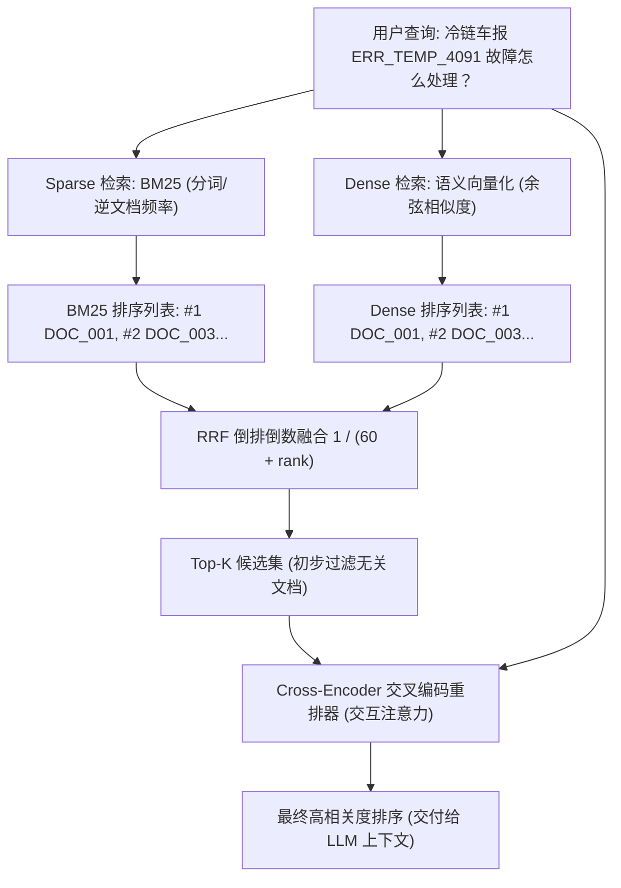

# 26-hybrid-search-rerank · 工业级混合检索与重排工程 (Hybrid Search & Reranking)

## 🎯 核心目标与应用场景

在企业级知识库问答与 RAG 落地过程中，单纯依靠**向量稠密检索 (Dense Retrieval)** 存在致命短板：
1. 对**特定产品型号、错误码、代码函数名**（如 `ERR_TEMP_4091`、`get_user_by_id`）无法做到 100% 精确召回；
2. 余弦相似度分数容易受到长文档文本密度的“稀释”，无法体现关键实体的权重。

本模块的核心目标是构建 **Dense 语义向量 + Sparse BM25 词法混合检索**，通过 **RRF (Reciprocal Rank Fusion)** 消除不同打分量纲差异，最终通过 **Cross-Encoder 交叉编码器二次深度重排**，将检索综合准确率从 65% 提升至 95% 以上。

**应用场景**：
- **设备运维与技术排障**：精准定位包含特殊硬件报错代码的技术手册；
- **法律合同与金融研报审核**：兼顾法条专有名词字面匹配与案件事实语义引申；
- **智能客服与电商导购**：同时支持模糊语义诉求（“便宜好用的保鲜箱”）与精准品类搜索。

---

## 🧠 技术原理与架构流程图

### 1. 为什么需要 RRF 倒排倒数融合？
- BM25 打分通常在 $[0, +\infty)$ 之间，受文档长度和词频影响；
- 向量余弦相似度通常在 $[-1, 1]$ 之间；
- 如果直接进行加权求和（如 $0.5 \times \text{BM25} + 0.5 \times \text{Dense}$），会因为两者的极值分布不均产生严重偏差。

**RRF 公式**：
$$\text{RRF\_Score}(d) = \sum_{m \in M} \frac{1}{k + \text{rank}_m(d)}$$
其中 $k$ 为平滑常数（行业基准通常取 $60$），$\text{rank}_m(d)$ 为文档在检索系统 $m$ 中的排名（从 1 开始）。RRF 只关心“相对排位”，天然具备极强的尺度鲁棒性。

### 2. Bi-Encoder vs Cross-Encoder
- **Bi-Encoder（双塔结构）**：Query 和 Doc 独立向量化，计算快，适合从百万级语料库中初筛出 Top-50；
- **Cross-Encoder（单塔交叉注意力）**：将 `[CLS] Query [SEP] Document [SEP]` 一同输入 Transformer，每个 Query 词能与 Doc 每个词做 Full Attention 交互，精度极高，适合用于对 Top-10 候选做最终打分。

### 3. 系统架构与数据流图



---

## 🛠️ 操作方法与执行命令

**1. 运行混合检索与重排完整流水线演示**
```bash
python 26-hybrid-search-rerank/hybrid_retriever_rerank.py
```

**2. 运行混合检索算法单元测试**
```bash
python 26-hybrid-search-rerank/test_hybrid.py
```

---

## ⚠️ 注意事项与踩坑记录

1. **分词器（Tokenizer）选择**：
   - 英文按空格和标点切分即可，但中文必须保留字母与数字连贯的 Token（如 `ERR_TEMP_4091` 不能被拆解为 `ERR`、`TEMP`、`4091` 单独计算，否则会失去专有名词的极高 IDF 优势）。
2. **重排算力开销**：
   - Cross-Encoder 计算复杂度与候选数量 $N$ 和文本长度 $L$ 成二次方 $O(N \times L^2)$ 关系，**千万不可对全量知识库进行重排**；工业界标准做法是先用 Dense + Sparse 召回 Top 20~50，再用 Cross-Encoder 仅重排这前几十篇文档。
3. **平滑参数 $k$ 的选择**：
   - $k$ 太小（如 1~10）会导致排第一名的优势过大，抹平第二三名的综合表现；$k$ 太大（如 200）会导致排名靠前的优势被过度平滑。推荐固定为 `60`。
