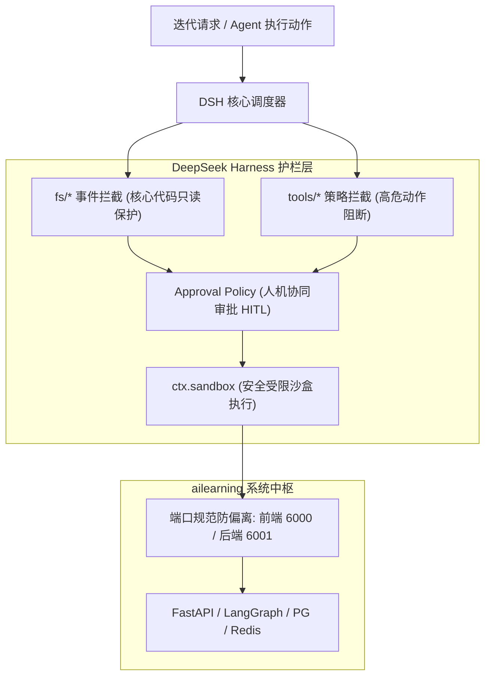

# 🧭 DeepSeek Research 与 DeepSeek Harness 架构防偏离治理指南

> **基于 Context7 官方最新文档与实践规范引入**  
> 官方包体系：`@deepseek-ai/deepseek-harness` (Cordis Plugin Framework) & DeepSeek-R1 / V3.2 系列推理研究中枢。

---

## 一、 为什么引入该体系？

在企业级 AI Agent 与复杂全栈系统的持续迭代演进中，开发团队和自治 Agent 最容易遇到以下**两大系统性风险**：

1. **架构漂移 (Architectural Drift)**：在不断添加新业务需求时，模块分层被随意穿透（例如前端跳过后端口令直连 DB、模块循环强依赖、端口随意乱改）。
2. **决策幻觉与破坏性改动 (Hallucinatory Degradation)**：Agent 在缺乏长链深度推演论证的情况下，盲目修改全局核心符号，导致级联崩溃。

为了保障 `ailearning` 项目在后续任何迭代中**“架构不偏离、底线不击穿、迭代可追溯”**，我们正式确立 **DeepSeek Research（前置研判）+ DeepSeek Harness（运行护栏）** 的双重防御机制。

---

## 二、 核心机制解析

### 1. 🧠 DeepSeek Research：深度研究推演与影响面研判 (Pre-Action Gate)

基于 DeepSeek-R1 / DeepSeek-Reasoner 的长思考链（Reasoning CoT）能力，确立**“未经 Research，不可擅动架构”**的原则：

*   **五步闭环研究范式 (5-Step Research Loop)**：
    ```
    [新需求/重构意向]
           │
           ▼
    ┌───────────────────────┐
    │ 1. 假设生成 (Hypothesize)│ 明确改动目标与技术边界
    └──────────┬────────────┘
               ▼
    ┌───────────────────────┐
    │ 2. 影响面检索 (Context)  │ 扫描调用链上游与下游影响符号
    └──────────┬────────────┘
               ▼
    ┌───────────────────────┐
    │ 3. 交叉检验 (Validate)   │ 验证对现行规范(如6000/6001端口)的影响
    └──────────┬────────────┘
               ▼
    ┌───────────────────────┐
    │ 4. 架构反思 (Reflect)    │ 是否破坏分层？是否引入单点瓶颈？
    └──────────┬────────────┘
               ▼
    ┌───────────────────────┐
    │ 5. 出具论证报告 (Report) │ 输出可落地的变更方案与回退方案
    └───────────────────────┘
    ```

### 2. 🛡️ DeepSeek Harness：插件式运行护栏与事件拦截 (Runtime Guardrail)

基于 `@deepseek-ai/deepseek-harness` 的 **Cordis 插件底座**，具备“一切皆插件（Everything-is-a-Plugin）”和全生命周期事件拦截能力：



---

## 三、 本地配置与工程化落地

### 1. 配置文件定义 (`dsh.config.yml`)
在项目根目录维护 [`dsh.config.yml`](file:///Users/mac/Documents/project/ailearning/dsh.config.yml)，定义固定不变的架构基准线：
*   **端口基准线**：锁定前端 `6000`、后端 `6001`，任何偏离该端口的提交直接拦截。
*   **受保护核心文件**：对 `backend/main.py`, `backend/orchestrator_graph.py`, `docker-compose.yml`, `.env` 设立防篡改写拦截。
*   **高危动作必须审批**：包含数据库 Drop/Alter、生产环境文件批量删除、带 sudo 的 Shell 命令。

### 2. 在 CI/CD 与自动化部署中的协同
在每次执行自动化发布（如 `./deploy.sh`）前，均自动加载该约束体系：
```bash
# 1. 执行前置架构与端口防偏离校验
# 2. 自动化构建与发布部署
./deploy.sh
```

---

## 四、 研发团队行为规范守则

1. **新特性开发必须先经过 Research 阶段**：任何跨模块调用或重构，需先梳理调用链路拓扑。
2. **禁止擅自更改预设端口约定**：前端必须统一使用 `6000` 端口入口，后端统一使用 `6001` 端口，保证容器化与多服务集群的清晰解耦。
3. **保持 Harness 审计日志归档**：所有被拦截的高危操作自动记录在 `logs/dsh_fs_audit.jsonl`，用于安全复盘。
