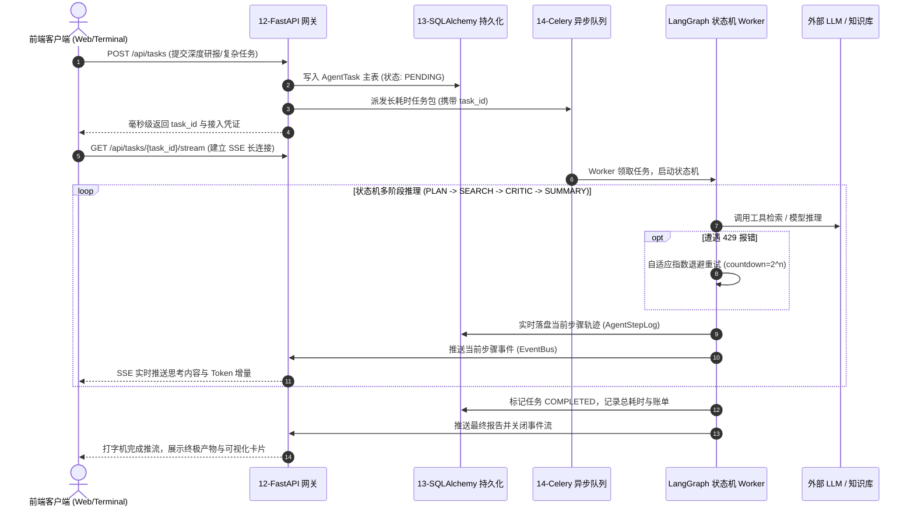

# ⚡ AgentForge · 智炼工坊
## 产品设计、技术架构与未来演进白皮书 (Product Design & Architecture Whitepaper)

> **版本**：v2.0 · Enterprise Edition  
> **定位**：面向 AI 全栈转型工程师与企业级 AI 架构师的工程化母座与实操练兵场  
> **🎯 终极目标**：**把复杂的内容简单化、产品化，让每一位传统工程师都能零阻力融入 AI 全栈转型开发中，实现极速平滑过渡！**

---

## Executive Summary 执行摘要

当前以 LLM 为核心的人工智能应用正在从“单次对话提示词（Prompting）”全面跃迁至“自主智能体系统（Agentic Systems）”。然而，行业面临着残酷的**工程落地断层**：成千上万的开发者能够依靠 LangChain 快速写出单机 Demo，却在面对千万级并发、长耗时推理（504 超时）、断电状态丢失、大模型 429 频率超限、越权逃逸与不可观测性时束手无策。同时，高昂的算力门槛、碎片化的技术栈和生涩的算法理论，将大量渴望转型的传统工程师拒之门外。

**AgentForge（智炼工坊）的核心使命，就是“把复杂简单化，把知识产品化”**。它不仅是一套覆盖“Prompt 设计 → 工具调用 → RAG 检索 → LangGraph 状态机 → 全栈工程底座 → 模型部署与微调”的 23 阶段递进式实操知识库，更是一个开箱即用、前后端分离、具备高抗击生产能力的企业级 Agent 基础设施平台。

产品通过独特的**“三层屏蔽机制”**（屏蔽硬件显卡、屏蔽中间件部署、屏蔽外部高昂 API），将底层所有繁琐摩擦关进黑盒，把最精髓的架构蓝图与生产级组件呈现在眼前，打造了一座通往 AI 全栈架构师的**无阻力平滑过渡之桥**。

---

## 一、 产品诞生背景与行业核心痛点

### 1.1 大模型时代的“Demo 陷阱”与生产鸿沟
在生成式 AI 落地过程中，业界普遍存在严重的“原型与生产割裂”：
- **玩具级（Toy App）**：几行 Python 脚本，调用 OpenAI API，在控制台 `print()` 结果。看起来无所不能，实则脆弱不堪。
- **生产级（Production System）**：必须应对大模型慢推理（数秒至数分钟）导致的网关超时崩溃、多用户高并发下的显存预热加载、长思考轨迹断点续传（Checkpoints）、多租户 Token 审计记账、以及自动化调用工具时的安全合规拦截。

### 1.2 传统工程师与全栈人员的 AI 转型断层
大量优秀的 Java、Go、Python 后端、前端及数据工程师希望转型为 **AI 全栈架构师**，但面临两大阻碍：
- **环境地狱**：CUDA 驱动版本冲突、PyTorch 编译报错、复杂的 Docker 中间件配置，耗费 80% 的精力在非业务逻辑上；
- **心智断层**：习惯了传统的确定性 CRUD 编程，对大模型的“非确定性、概率生成、循环反思状态机、语义向量检索”缺乏系统的工程化心智模型。

---

## 二、 核心解决的问题 (Core Problems Solved)

AgentForge 围绕真实企业落地中的 5 大核心瓶颈，给出了成套确定性的工程解法：

```
                    ┌─────────────────────────────────────────────────────────┐
                    │               AgentForge 核心攻克的五大生产难题         │
                    └───────────────────────────┬─────────────────────────────┘
                                                │
       ┌──────────────────┬─────────────────────┼─────────────────────┬──────────────────┐
       ▼                  ▼                     ▼                     ▼                  ▼
【1. 状态与轨迹持久化】 【2. 并发长任务解耦】  【3. 混合检索防幻觉】 【4. 生产安全与合规】 【5. 科学评测与可观测】
LangGraph + 异步 ORM   FastAPI + Celery      BGE-M3 + BM25 稀疏    HITL 人机审批中断点   Ragas 四大指标量化
状态快照断点续传       429 智能自适应指数退避 + Rerank 重排混合检索 + 沙箱隔离防逃逸     + LangSmith 全链路
杜绝重启上下文丢失     多 Agent 并行汇聚     大幅降低大模型幻觉    保障高危动作可控     告别拍脑袋凭感觉调试
```

1. **状态持久与防丢（State Persistence & Checkpoints）**：
   - 解决原生 Python 内存保存上下文在断电或重启时全盘丢失的问题。
   - 方案：通过 SQLAlchemy 2.0 异步 ORM 与 LangGraph 状态图绑定，将每一步思考轨迹（Node）、输入输出与 Token 账单落盘。
2. **长耗时推理与系统高可用（Decoupled Long-Running Tasks）**：
   - 解决深度研报或复杂 Agent 运行 3 分钟引发前端 504 Gateway Timeout 及第三方 API 429 限流雪崩。
   - 方案：FastAPI 接入层毫秒级返回 `task_id`，Celery + Redis 分布式集群异步消费，内置自适应指数退避（`countdown=2^n`）与 Chord 原语并行汇聚。
3. **知识精准检索与消除幻觉（Hybrid RAG & Precision）**：
   - 解决单一稠密向量召回率低、专业名词失真、表格数据丢失的难题。
   - 方案：密集语义向量（BGE-M3）与稀疏关键词（BM25）混合加权，引入 Cross-Encoder 深度重排与 GraphRAG 实体知识图谱。
4. **高危行为可控与安全沙箱（Security & Human-in-the-Loop）**：
   - 解决 Agent 自主生成执行代码、操作数据库可能导致的不可逆生产事故。
   - 方案：在 LangGraph 状态机中设置 `interrupt_before` 中断点，必须由人类管理员在 Web 端确认后方可唤醒执行；代码执行全面接入 Docker/AST 静态审查沙箱。
5. **科学量化评估与白盒追踪（Scientific Evaluation & Observability）**：
   - 解决优化 Prompt 缺乏客观衡量标尺的问题。
   - 方案：全面接入 Ragas（真实性 Faithfulness、回答相关性 Answer Relevance、上下文精准度 Context Precision、召回率 Context Recall）与 LangSmith 全链路 Trace 图。

---

## 三、 产品核心价值与吸引力 (Value Proposition)

### 3.1 零摩擦学习体验（Zero-Friction Startup）
- **屏蔽环境与依赖**：全模块默认采用轻量级组件（如异步 SQLite/aiosqlite、纯 CPU 向量运算），无需购买高端 GPU 显卡；
- **屏蔽 API 与费用**：内置 Simulation 模拟推理引擎与本地轻量化模型支持，学习者在没有外部 API Key、断网离线状态下，依然能跑通全套状态流转与评测；
- **双模即时切换**：既支持单脚本 5 秒极速体验，也支持一键 `docker-compose up -d` 部署企业级集群。

### 3.2 穿透玩具到生产的企业级闭环
不同于市面上仅教写单个函数或调调 API 的教程，AgentForge 每一个章节都是按照**企业生产标准**打造（如 FastAPI 的 Lifespan 显存预热、连接池探活 `pool_pre_ping`、Alembic 数据库迁移、SSE 逐字流式打字机）。

### 3.3 资产化沉淀，立项即复用
所有模块均遵循统一的代码规范（强类型注解、健壮错误捕获、模块解耦）。项目孵化的核心实战组件（如企业级知识库、`RepoSense` 代码助手、`document_processor` 多格式解析器、全栈架构引擎）可直接作为企业内部立项的脚手架快速交付业务。

### 3.4 终极设计哲学：“复杂内容简单化、产品化”的四大极简支柱

要让每一位无论有无 AI 算法基础的工程师都能在 1-2 周内完成转型，AgentForge 确立了四项不可动摇的极简产品化准则：

```
                    ┌─────────────────────────────────────────────────────────┐
                    │       “把复杂内容简单化、产品化”的四大极简支柱           │
                    └───────────────────────────┬─────────────────────────────┘
                                                │
       ┌──────────────────┬─────────────────────┴───────────────┬──────────────────┐
       ▼                  ▼                                     ▼                  ▼
【支柱 1：认知降维】      【支柱 2：胶囊化工程】                【支柱 3：具象工作台】  【支柱 4：渐进式转型飞轮】
拒绝数学公式恐吓，用      告别零散脚本，每个章节封装为           内置 Web 终端、Monaco  Day 1 极速正反馈
Mermaid 状态图与业务     高内聚、确定性、开箱自运行的           沙箱与 SSE 实时推流，  Day 7 跑通全栈底座
隐喻让人人听得懂          “功能工程胶囊”                        让抽象的 Token 具象化  Day 14 企业独立立项
```

1. **认知降维（Cognitive Deconstruction）**：
   - 不搞复杂的纯数学矩阵公式恐吓学员，用清晰直观的 **Mermaid 架构流程图** 和**生活化业务隐喻**拆解本质（例如把 Embedding 比喻为“语义经纬度定位”，把 LangGraph 状态图比喻为“带记忆的工作审批流”）。
2. **胶囊化工程交付（Encapsulated Delivery）**：
   - 杜绝传统教程中“贴一段伪代码、漏一段依赖、需要读者自己拼装”的粗糙做法；
   - 每一个章节就是一个**完整的业务功能胶囊**：内置完整 Type Hints 类型推导、异常处理、自测入口与自给自足的数据集，拷贝即能工作。
3. **具象化沉浸工作台（Productized Workstation）**：
   - 抽象的 State 和 Token 看不见摸不着，容易劝退初学者。AgentForge 研发了可视化的 Web 交互终端与 Monaco 代码沙箱，把后台流转的每一步状态变更、Prompt 组装、Token 消耗以**可视化打字机卡片**的形式直接呈现在屏幕上，所见即所得。
4. **渐进式转型飞轮（Progressive Transition Flywheel）**：
   - **第 1 天（破冰）**：单脚本 5 秒跑通，建立“我原来也能做 AI 交互”的强烈心理正反馈；
   - **第 3 天（进阶）**：掌握 LangGraph 状态机与 RAG 检索微调，脱离单次对话思维；
   - **第 7 天（质变）**：运行 15 章节，跑通 FastAPI + Celery + SQLAlchemy 的全栈生产级闭环；
   - **第 14 天（出师）**：将内置的组件与白皮书复用到所在企业，主导 AI 商业项目立项落地！

---

## 四、 面向用户与目标画像 (Target Audience)

| 目标角色 | 用户痛点 | AgentForge 带来的核心价值 |
| :--- | :--- | :--- |
| **全栈 / 后端工程师**<br>*(Java / Go / Python)* | 熟悉传统高并发与微服务，但面对大模型的流式推流、状态机与 RAG 缺乏系统架构体系。 | 提供 FastAPI、SQLAlchemy、Celery、LangGraph 深度融合的标准化 AI 工程底座与脚手架。 |
| **AI / LLM 应用工程师** | 精通 Prompt 和模型微调，但缺乏企业级工程经验，代码停留在 Jupyter Notebook。 | 学习完整的工程化防线：断点续传、连接池防雪崩、429 降级重试、安全沙箱与企业白皮书。 |
| **团队 Tech Lead / 架构师** | 面临团队向 AI 转型压力，需要评估技术栈选型、架构风险、成本控制与合规审计方案。 | 提供现成的全景技术架构图、评估指标体系、安全治理规范及企业级白皮书。 |
| **AI 原生创业者 / 独立开发者** | 资源有限，急需高完成度、前后端一体、开箱即用的垂直 AI Agent 商业产品原型。 | 直接复用现代化 React 沉浸式工作台与后端混合检索引擎，以天为单位构建自研商业应用。 |

---

## 五、 系统总体技术架构设计 (Technical Architecture)

### 5.1 六层技术全景图

```
┌─────────────────────────────────────────────────────────────────────────────┐
│                    🖥️ 第一层：现代生产级交互层 (Presentation UI)            │
│       React 18 + Vite 沉浸式终端 · Monaco 代码沙箱 · SSE 流式打字机推流       │
├─────────────────────────────────────────────────────────────────────────────┤
│                    🌐 第二层：企业高性能网关与 API 接入层 (API Gateway)       │
│      FastAPI 异步路由 · Lifespan 显存预热 · Depends 鉴权树 · 耗时监控中间件     │
├─────────────────────────────────────────────────────────────────────────────┤
│                    🤖 第三层：智能体认知编排与控制层 (Agent Orchestration)    │
│     LangGraph 有状态状态机 · AutoGen 多智能体协同 · HITL 审批 · 动态路由      │
├─────────────────────────────────────────────────────────────────────────────┤
│                    🧠 第四层：知识引擎与深度记忆层 (Knowledge & Memory)       │
│    Hybrid RAG (BGE-M3 + BM25 + Rerank) · GraphRAG 图谱 · 短期摘要 + 长期画像 │
├─────────────────────────────────────────────────────────────────────────────┤
│                    ⚙️ 第五层：工程基础设施与持久化层 (Infrastructure Base)    │
│    SQLAlchemy 2.0 异步 ORM · PostgreSQL 记忆库 · Celery + Redis 异步长任务队列│
├─────────────────────────────────────────────────────────────────────────────┤
│                    📡 第六层：模型与计算底座 (Model & Compute Engine)         │
│     OpenAI SDK · DeepSeek · ONNX Runtime · Transformers · Apple Silicon MPS │
└─────────────────────────────────────────────────────────────────────────────┘
```

### 5.2 “三层屏蔽”零摩擦机制实现
1. **API 屏蔽层**：提供 `SimulationRunner`，拦截网络请求并注入确定性模拟应答，确保零 API 成本下的核心逻辑调试；
2. **硬件屏蔽层**：通过 ONNX 运行时和量化技术，在普通笔记本的 CPU 或 Mac 统一内存（MPS）上流畅运行 Embedding 与视觉推理；
3. **中间件屏蔽层**：支持无外部依赖的单机内嵌运行模式（SQLite + 单进程协程任务），同时无缝兼容容器化外挂（Docker Postgres + Redis）。

### 5.3 核心全栈协同闭环时序



---

## 六、 产品的未来演进方向 (Future Roadmap)

站在 AI 技术演进的最前沿，AgentForge 将持续沿以下四大战略维度深度迭代：

```
                              ┌───────────────────────────┐
                              │    AgentForge 未来演进路线 │
                              └─────────────┬─────────────┘
                                            │
       ┌────────────────────────┬───────────┴────────────┬────────────────────────┐
       ▼                        ▼                        ▼                        ▼
【6.1 自主智能体协作网络】 【6.2 认知图谱与多模态 RAG】 【6.3 边缘侧与端云异构计算】 【6.4 生产级自治自愈安全体】
Agent-to-Agent (A2A)     GraphRAG 知识图谱       Apple Silicon 硬件加速   运行时自我反思与动态熔断
跨系统 MCP 协议联邦       多模态时序深度对齐       端侧极速隐私离线闭环     自适应防注入红蓝攻防
```

### 6.1 自主智能体协作网络 (Agent Network & A2A Ecosystem)
- **协议升级**：深化 **MCP (Model Context Protocol)** 联邦体系，使不同的 Agent（代码助手、文档解析器、SQL 报表专家）能够跨进程、跨机器甚至跨企业通过标准化协议互相发现与调用。
- **群体智能分层演进**：探索类似 Swarm 的动态自治网络，Agent 能够根据任务复杂度自主协商、动态组队、推举 Leader，实现真正的大规模分布式自主协作。

### 6.2 认知图谱与多模态知识引擎 (GraphRAG & Cognitive Memory)
- **从文本向量到知识图谱**：深度集成 Neo4j 与 GraphRAG，不仅能检索“相似段落”，还能在海量异构非结构化数据中挖掘复杂实体关系链，实现跨文档的“多跳（Multi-Hop）逻辑推理”。
- **全媒介时序多模态**：支持音视频流的实时时序语义索引、高密度工程图纸与复杂财务报表的空间语义识别，打造全息知识引擎。

### 6.3 边缘侧与端云异构计算 (Edge AI & Heterogeneous Compute)
- **端侧本地高可用**：深度拥抱 Apple Silicon (MLX / Metal) 与 ONNX 端侧加速架构，让企业核心高密数据在完全断网（Air-Gapped）环境下即可运行 7B~14B 参数级别的高性能自主智能体。
- **端云混合协同 (Hybrid Edge-Cloud)**：在端侧完成敏感信息提取、意图初筛与数据脱敏，仅将高难度推理路由至云端巨型模型，兼顾数据隐私、响应延迟与运行成本。

### 6.4 生产级自治自愈安全体系 (Self-Healing & Autonomous Security)
- **运行时自愈熔断**：实时监控 Agent 的 Token 消耗速率、循环递归深度与语义发散度。当监测到死循环或上下文污染时，系统自动挂起并执行“状态快照回滚（State Rollback）”与自我纠偏。
- **自适应红蓝对抗防线**：内置自动化的提示词注入（Prompt Injection）与越狱拦截器，在每一道工具调用前进行动态 AST 审查与意图审计，守住企业数据资产的最底线。

---

## 结语

**AgentForge · 智炼工坊** 坚信：**“工程落地能力是 AI 时代最坚固的护城河。”**  
通过将最前沿的 AI 架构理论转化为可运行、可复现、可生长的工业级代码资产，本项目致力于成为每一位中国工程师迈向 **AI 全栈架构师** 路上最坚实、最可靠的底座级伙伴。
