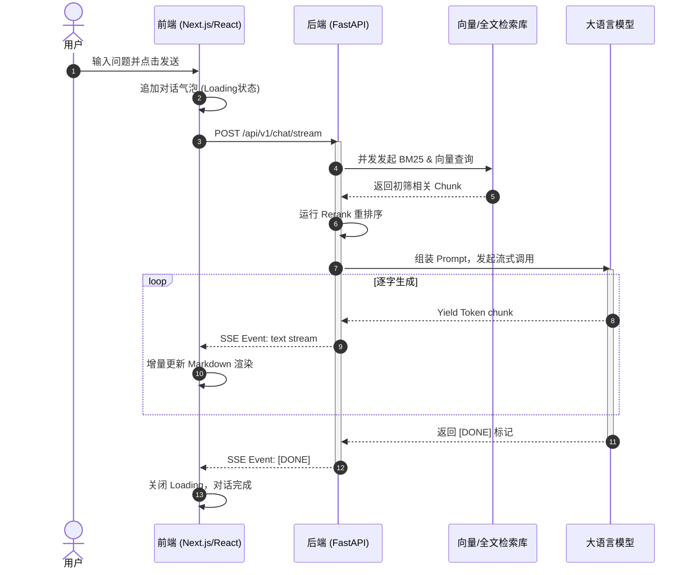

# 混合检索问答子系统 (Hybrid RAG Chatbot) 技术方案设计文档

## 1. 概述与背景
在当前 AI 工程落地中，单纯依赖大语言模型的生成容易产生“幻觉”，且无法获取企业私有知识。因此，我们设计了 **Hybrid RAG (混合检索增强生成) 问答子系统**。
本文档详细阐述该子系统的技术架构、选型依据、前后端数据流、API 契约及前端工程规范，确保产研团队在开发过程中的规范性与一致性。

---

## 2. 架构与技术选型及理由

### 2.1 后端技术栈
- **框架**: `FastAPI`
  - *选型理由*: 原生支持异步 (Asyncio)，对流式输出 (Streaming Response) 极为友好；自带 Pydantic 数据校验和 OpenAPI (Swagger) 文档自动生成。
- **向量数据库**: `ChromaDB` (或生产级平替 Milvus)
  - *选型理由*: 轻量、易部署，且自带本地持久化能力，十分适合作为中小型企业级知识库底座。
- **大模型生态**: `LangChain` + `OpenAI SDK`
  - *选型理由*: 标准化工具链，便于在 GPT-4o、DeepSeek 等大模型之间无缝切换。
- **检索算法**: `BM25` (关键字) + `BGE` (向量语义) + `CrossEncoder` (重排)
  - *选型理由*: 单一向量检索在处理专有名词、编号时效果差；混合检索 + Rerank 重排能极大提升 Top-K 命中率。

### 2.2 前端技术栈 (根据 3-5 人敏捷小团队特点)
- **核心框架**: `React 18` + `Next.js 14 (App Router)`
  - *选型理由*: 支持服务端渲染(SSR)，首屏加载快（SEO友好）。React 生态极为丰富，便于快速集成各类 Markdown 渲染和流式输出组件。
- **UI 组件库**: `TailwindCSS` + `shadcn/ui`
  - *选型理由*: 传统的 Ant Design 等组件库显得过于“后台化”，`shadcn/ui` 提供了极高的定制自由度，非常契合现代 AI C端/B端产品的极简极客审美。
- **状态管理**: `Zustand`
  - *选型理由*: 相较于 Redux 极致轻量，无需写大量样板代码，极其适合构建对话流和多轮历史记录的状态存储。
- **请求与数据流**: `SWR` / `React Query` + 原生 `fetch` (针对流式打字机效果)
  - *选型理由*: 处理标准 Restful 请求具有优秀的缓存策略；流式输出结合 `fetch` 的 `ReadableStream` 进行逐字渲染。

---

## 3. 核心业务数据流 (Data Flow)

系统的核心数据流是从用户发起提问，到检索引擎双路召回，再到 LLM 融合生成的完整链路。

```mermaid
graph TD
    A[前端用户输入 Query] --> B[API 网关 / Next.js API Route]
    B --> C[FastAPI 后端问答接口]
    
    C --> D{意图/分类判定}
    D -->|普通对话| E[直接请求 LLM]
    D -->|知识库问答| F[双路召回引擎]
    
    F --> G[BM25 关键词检索]
    F --> H[Embedding 向量检索]
    
    G --> I[召回文档归一化合并]
    H --> I
    
    I --> J[CrossEncoder Reranker 精排 Top-K]
    J --> K[Prompt 组装: 上下文+问题]
    
    K --> L[大语言模型 (DeepSeek/GPT)]
    E --> L
    
    L --> M[SSE Server-Sent Events 流式返回]
    M --> N[前端打字机渲染]
```

---

## 4. 核心时序图 (Sequence Diagram)

这里重点展示前端发起“流式知识库问答”交互的时序细节：



---

## 5. API 接口定义约定

接口遵循 RESTful 规范，并采用 OpenAPI (Swagger) 格式产出契约。

### 5.1 发起对话 (流式)
- **Endpoint**: `POST /api/v1/chat/stream`
- **Headers**: 
  - `Content-Type: application/json`
  - `Authorization: Bearer <token>`
- **Request Body**:
  ```json
  {
    "session_id": "uuid-1234",
    "query": "你们的退货政策是什么？",
    "use_rag": true,
    "top_k": 5
  }
  ```
- **Response**: `text/event-stream`
  ```text
  data: {"id": "msg_1", "content": "我们", "role": "assistant"}
  data: {"id": "msg_1", "content": "的退货", "role": "assistant"}
  data: {"id": "msg_1", "content": "政策是...", "role": "assistant"}
  data: [DONE]
  ```

---

## 6. 前端工程规范与接口层约定

为了适应快速迭代的特点，对前端架构的组织提出如下规范：

### 6.1 工程目录结构约定
```text
src/
├── app/                  # Next.js App Router 页面路由
├── components/           # UI 组件
│   ├── ui/               # 基础原子组件 (shadcn 自动生成)
│   └── business/         # 业务组件 (如 ChatBubble, RAGSourceList)
├── lib/                  # 工具函数
│   ├── api/              # 接口请求封装层 (axios/fetch 实例)
│   ├── store/            # Zustand 状态切片 (对话历史, 用户状态)
│   └── utils.ts          # 常用公共类 (如 className 合并)
└── types/                # 全局 TypeScript 接口定义
```

### 6.2 接口层 (API Layer) 约定
前端不应在业务组件中直接拼写 URL 或直接调用 `fetch`。
必须在 `src/lib/api/` 中进行统一封装：
1. **统一错误处理**：对于 401 自动跳转登录页；对于 500 统一弹出 Toast。
2. **流式请求封装**：单独封装 `fetchStream(url, params, onMessage, onDone)` 方法处理 `ReadableStream`。

### 6.3 代码规范
1. 强制启用 `ESLint` + `Prettier`。
2. **类型安全**：禁止使用 `any`。所有 API Request 和 Response 必须在 `types/` 中定义对应的 `interface`。

---

## 7. 风险评估与应对策略

| 风险点 | 影响程度 | 发生概率 | 应对策略 / 兜底方案 |
| --- | --- | --- | --- |
| **LLM 接口限流或超时** | 高 | 中 | 1. 引入指数退避重试 (Tenacity)。<br>2. 超过阈值时触发熔断，返回友好提示。 |
| **混合检索召回率不达标** | 高 | 中 | 1. 开放管理员干预后台，支持人工上传 Q&A 对以高优匹配。<br>2. 每周分析无答案日志，持续调整 Rerank 阈值。 |
| **流式连接 (SSE) 意外断开** | 中 | 高 | 1. 前端实现重连机制 (Reconnecting EventSource)。<br>2. 后端保存完整的生成结果，前端重连后可通过普通接口拉取完整记录。 |
| **Token 爆炸与资源消耗** | 高 | 低 | 1. 后端计算 Token 窗口大小，采取截断历史记录或“自动摘要”策略来保持上下文。<br>2. 采用 Semantic Cache (语义缓存)，对于相同或高度相似问题直接返回缓存结果。 |
