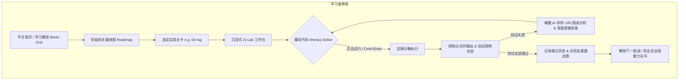

# AI 工程师能力实战平台 (AI-LeetCode & Lab Workbench) 架构规划与设计方案

> **文档版本**: v1.0.0  
> **创建日期**: 2026-09-16  
> **定位标杆**: Linear / Raycast 极客暗黑美学 + LeetCode 沉浸式编码实战 + Cursor/DeepSeek 伴学助手  
> **适用范围**: ailearning 项目全栈产品化改造方案

---

## 1. 愿景与产品定位 (Vision & Goals)

### 1.1 现状分析
当前 `ailearning` 仓库沉淀了 24 个系统级 AI 工程阶段（从 `01-prompt-engineering` 到 `23-edge-ai`），涵盖了 Prompt 工程、Function Calling、MCP 协议、RAG、Agent 编排、模型量化推理与安全等业界前沿技能。然而目前多为静态代码与离线运行测试，缺乏统一的产品化交付界面与学习闭环反馈机制。

### 1.2 核心愿景
将静态代码库升级为**企业级 AI 工程师实战工作台（AI-LeetCode & Interactive Lab）**：
- **实战闯关化**: 将 24 个阶段代码转化为可交互的阶梯式实验挑战题。
- **沉浸式开发体验**: 提供媲美 VS Code / Cursor 的 Monaco 在线代码编辑器、实时运行终端与自动化单元测试通过率检测。
- **双模 AI 智能伴学**: 深度集成 DeepSeek-R1 深度思考推理 + DFL（自适应门控与决策反馈）智能导师，提供实时 Code Review、错误根因分析与思路引导。
- **高级极客视觉**: 汲取 Linear / Raycast 的现代暗黑工程美学（深邃黑调、1px 发光微边框、毛玻璃浮层、流畅的键盘流快捷操作）。

---

## 2. 方案对比与架构抉择 (Architectural Trade-offs)

针对本次改造，评估三种技术实施路径：

| 评估维度 | 方案 A：敏捷一体化 SPA (推荐) | 方案 B：全量 Next.js 14 重构 | 方案 C：纯前端 Pyodide 方案 |
| :--- | :--- | :--- | :--- |
| **前端栈** | React 19 + Vite + Monaco Editor | Next.js 14 App Router + Tailwind | React + Pyodide (WebAssembly) |
| **后端栈** | 现有 FastAPI 扩展 + Docker 沙箱 | NestJS/Go 微服务 + 编排中间层 | 纯静态，无真实后端 |
| **执行能力** | 支持真实 PyTorch/Chroma/Transformers | 支持真实后端环境与任务队列 | 无法运行 PyTorch/CUDA/LangGraph 完整依赖 |
| **视觉定制度** | 极高（已具备 Monaco、Markdown、Lucide 等） | 高（依赖生态生态组件库） | 中等 |
| **改造成本与周期** | **低/中（无缝复用当前容器与端口体系）** | 极高（需重写大量既有 API 与部署流） | 极低（但无法满足高级 AI 工程学习） |
| **企业级评测** | 宿主机/隔离容器沙箱测试用例验证 | 复杂云端容器调度集群 | 纯浏览器端沙盒，易崩溃 |

> **最终选型：方案 A（敏捷一体化 SPA 架构）**  
> 保持与当前 Docker 架构 (`6001` 后端 / `6002` 前端) 的完美兼容，最大化复用已有 24 阶段的真实代码和测试脚本，同时将 UI 从单纯的“Chat 对话窗”彻底重构成“企业级三栏沉浸式 AI 工作台”。

---

## 3. 信息架构与用户旅程 (Information Architecture)



### 3.1 页面层级划分
1. **全局导航栏 (Top Header)**:
   - 品牌 Logo (`AI Learning Lab`)
   - 阶段进度指示器（已完成 / 总挑战数）
   - 学习仪表盘入口 (Dashboard)
   - 全局搜索 & 命令面板 (`Cmd + K`)
   - 个人偏好与沙箱运行状态指示灯
2. **AI Lab 实战工作台 (核心界面，支持拖拽调节宽度)**:
   - **左侧面板 (25%) - 关卡体系导航**:
     - 24 阶段模块树（折叠展开、难度标签、通过状态标记）。
     - 实验要求与目标清单 (Checklist)。
   - **中间面板 (35%) - 理论指导书 & 架构图解**:
     - 教学 Markdown、Mermaid 流程图（如 RAG 检索流程、Agent 状态转移图）。
     - 重点知识摘要与避坑指南。
   - **右侧面板 (40%) - Monaco 编码沙箱与运行控制台**:
     - 顶部：代码标签页（`starter_code.py`、`solution.py`、`test_cases.py`），重置代码、一键运行 (`Cmd+Enter`)、提交评分。
     - 中部：Monaco 高性能代码编辑器，支持 Python 语法提示、折叠与格式化。
     - 底部：双 Tab 抽屉：
       - **终端输出 (Terminal Console)**: 标准输出、错误栈、测试用例 Pass/Fail 状态。
       - **AI 伴学导师 (AI Mentor)**: DeepSeek + DFL 智能分析、代码重构建议、知识点扩展。

---

## 4. Linear / Raycast 级极客暗黑视觉设计系统

遵循现代专业开发者工具的设计哲学，拒绝粗糙与平庸，呈现克制、精密、高效的美学质感。

### 4.1 配色规范 (Color Palette)
```css
:root {
  /* 背景基底：层级渐进曜石黑 */
  --bg-canvas: #090a0f;       /* 最底层工作台背景 */
  --bg-surface: #11131a;      /* 卡片与侧栏背景 */
  --bg-elevated: #181b24;     /* 悬浮菜单、模态窗 */
  --bg-glass: rgba(17, 19, 26, 0.75); /* 毛玻璃透明层 */

  /* 边框与发丝线 */
  --border-subtle: rgba(255, 255, 255, 0.08); /* 基础 1px 分割线 */
  --border-active: rgba(99, 102, 241, 0.4);   /* 激活高亮边框 */
  
  /* 品牌核心与功能色 */
  --accent-primary: #6366f1;   /* 极光紫 (Indigo) - 核心品牌色 */
  --accent-glow: rgba(99, 102, 241, 0.25);
  --accent-success: #10b981;   /* 翡翠绿 (Emerald) - 测试通过、完成 */
  --accent-warning: #f59e0b;   /* 琥珀黄 (Amber) - 提示与警告 */
  --accent-error: #ef4444;     /* 珊瑚红 (Rose) - 语法错误、测试失败 */

  /* 文字对比层级 */
  --text-primary: #f8fafc;     /* 纯净亮白 (95% 对比度) */
  --text-secondary: #94a3b8;   /* 灰蓝正文 (适合长时间阅读) */
  --text-muted: #64748b;       /* 次要注记、占位符 */
}
```

### 4.2 质感与微交互细节
1. **发丝边框与微发光 (Border & Subtle Glow)**:
   - 容器边缘均采用 `1px solid var(--border-subtle)`。
   - 获得焦点或选中的关卡卡片具有 `box-shadow: 0 0 15px -3px var(--accent-glow)`。
2. **毛玻璃特效 (Glassmorphism)**:
   - 全局 Header 与悬浮工具栏采用 `backdrop-filter: blur(12px)`，透出底层的代码滚动纹理。
3. **极客键盘流 (Keyboard First)**:
   - 全局快捷键驱动：
     - `Cmd + Enter`: 触发沙箱执行与代码评测。
     - `Cmd + K`: 调出全局关卡与知识点跳转面板。
     - `Cmd + J`: 切换底部终端展开/收起。
     - `Cmd + M`: 呼出 AI 导师分析。

---

## 5. 核心模块技术实现方案

### 5.1 课程与关卡自动解析引擎 (Curriculum Engine)
在后端实现 `backend/curriculum_engine.py`：
- **资源扫描**: 自动扫描 `01-prompt-engineering` 至 `23-edge-ai` 目录结构。
- **关卡定义提取**: 解析每个阶段下的 `README.md`（作为 Mission Guide）、主要的示例 Python 文件（作为 Starter Code）、以及 `test_*.py`（作为评测用例）。
- **RESTful API 契约**:
  - `GET /api/v1/curriculum/phases`: 获取全部 24 阶段列表、完成度统计。
  - `GET /api/v1/curriculum/phase/{phase_id}`: 获取指定阶段的详细实验指南、初始代码模板与测试规格。
  - `POST /api/v1/curriculum/run`: 提交用户编辑的代码，在沙箱环境中运行。
  - `POST /api/v1/curriculum/verify`: 运行内置单元测试套件，返回测试通过率（Pass/Total）。

### 5.2 安全代码执行沙箱 (Secure Sandbox Runner)
为符合企业级安全要求，防止用户编写恶意代码逃逸或消耗宿主机资源：
- **进程级别资源限制**:
  - 利用 Python `subprocess` 并在后台设置 `preexec_fn`（设置 `RLIMIT_AS` 内存上限 1024MB，`RLIMIT_CPU` 最大执行时间 10 秒）。
  - 超时保护：超过 10 秒自动熔断终止，防止死循环。
  - 标准输入输出捕获：将 `stdout` 和 `stderr` 格式化为结构化 JSON 流式返回。

### 5.3 智能伴学导师 (AI Mentor with DFL & DeepSeek)
- 结合此前已融入的 `DFL`（自适应门控融合与决策反馈机制）和 DeepSeek 大模型：
  - 当代码运行失败时，AI 导师自动分析报错堆栈与 AST 语法，给出两阶段反馈：
    - **Step 1: 思维引导（Hint）**：指出逻辑盲点或 API 误用，不直接剧透代码。
    - **Step 2: 架构对比（Deep Review）**：提供规范化生产级代码参考与复杂度分析。

---

## 6. 实施路线图 (Implementation Roadmap)

| 阶段 | 周期 | 核心交付物 | 质量验收标准 |
| :--- | :--- | :--- | :--- |
| **Phase 1: 课程引擎与数据接口** | 1~2 天 | 后端 `curriculum_engine.py` & 沙箱执行器 API | 能够自动读取 24 阶段目录，提供阶段详情与安全运行接口 |
| **Phase 2: 现代极客工作台 UI 重塑** | 2~3 天 | 沉浸式三栏工作台组件、Monaco 集成、Linear 暗黑视觉样式 | 界面视觉高级，支持拖拽分屏，代码编辑与终端高保真展示 |
| **Phase 3: 运行闭环与 AI 伴学打通** | 1~2 天 | 前端沙箱运行联动、测试用例打分器、AI 导师一键纠错 | 敲击 `Cmd+Enter` 实时出结果，测试失败时 AI 准确给出指导 |
| **Phase 4: 进度持久化与企业级仪表盘** | 1 天 | LocalStorage / 后端进度存储、技能雷达图组件 | 记录各阶段通关情况，直观呈现 AI 全栈能力分布 |

---

## 7. 结论与确认

本规划方案将当前项目从“单点技术演示脚本”质变为“兼具企业级严谨性、极客视觉美学与实战学习闭环的 AI 平台”。
请审阅上述规划与架构设计。如无异议，我们将进入实施计划（Implementation Plan）编制并开始编码落地。
