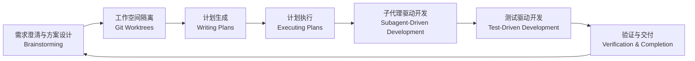

# OpenCode + OhMyOpenCode + SuperPowers  实践

## 简介

### OpenCode

- 一款开源的 AI 编程 Agent，能对接市面上绝大多数的 AI Coding 大模型：Claude、GPT、GLM、Kimi、MiniMax、硅基流动、甚至你本地部署的模型（ollama、lmstudio）...

- 有了它，你不用打开的 IDE，而是直接在终端与 AI 交互，给他传达你的需求，它就能帮你完成，你只需要负责需求输入，调整方向，审核即可。

- 项目分析、权限、插件、MCP、skills，应有尽有。
- 时不时有些新模型可以免费使用（一般一个月以上）。

### OhMyOpenCode

- （现改名为 OhMyAgent）OpenCode 最著名插件，对 OpenCode 做史诗级的增强。
- 提示词重写优化。你写的差没关系，它帮你梳理清晰。
- 多成员协同，构成开发军团。调研分析、代码检索、设计、规划、任务拆解、任务执行、文档...（不同的成员可以使用不同的模型，充分发挥不同模型在各自领域的优势。）例如：
  - Claude Opus 4.6，Kimi K2.5：设计、任务规划、Subagent 调度、验证、需求澄清
  - GPT 5.4，GLM 5：执行编码任务、长周期深度工作
- 多任务并行执行。主大脑拆解、调度，SubAgent 并行执行

a.**编排器与调度器**

1. **Sisyphus**（主控 & 总工程师）

- 西西弗斯主agent，绝大多数时候都是和用户对话的agent和所有任务的入口
- 总规划编排调度，可以调用其他subagent，必要时还可以临时创建特定任务的agent
- 非常简单的任务也会自己直接阅读/写代码，有时其他agent职责没有覆盖/完成的也会自己上手

1. **Atlas**（调度器 & 计划执行器）

- 阅读Sisyphus或者Prometheus的**plan**，逐条执行**ToDo**
- 主要功能是调用其他**subagent**，分配具体任务
- 简单问题也会自己直接执行读写文件

b.**计划与验证**

1. **Prometheus**（战略规划师）

- 生成**plan**给Atlas，一般由Sisyphus调用，如果用户对任务有详细的认知和描述可以手动切换直接与Prometheus对话，这样会更精确执行用户的目标
- 可能会询问用户问题来澄清需求

1. **Metis**（预分析规划顾问）

- Prometheus的分析顾问，制定**plan**之前的风险分析和方案探索
- 挖隐含需求、补上下文、避免过度设计

1. **Momus**（战略审查师）

- 作为Prometheus的审稿人对**plan**审查与结果验证

c.**检索与顾问**

1. **Oracle**（架构/调试顾问）

- 当其他agent（Atlas/Sisyphus等）有疑问的时候调用Oracle解决局部难点
- 一般是解释代码给出建议，做头脑风暴、审阅

1. **Librarian**（检索专家）

- grep文档、API、README、GitHub代码
- 当其他agent需要外部信息的时候调用它

1. **Explore**（代码库探索）

- 做结构化的语义grep，告诉其它agent某段逻辑、风格
- 当其他agent需要本地文档信息的时候调用它

1. **multimodal‑looker**（多模态分析师）

- 查看PDF、图片、截图等内容

d.**执行器**

1. **Hephaestus**（长周期执行器）

- 利用codex系列长期工作的特性执行那些需要几十分钟起步的任务
- 循环跑读、写代码、运行、检查结果的循环
- 由Sisyphus或Atlas调用

1. **Sisyphus‑Junior**（单任务执行器）

- 由用户创建或者Sisyphus临时生成的特定任务执行器
- 专注于某一种任务的执行，可以读写代码
- 用户可以手动在categories字段创建（见下文的json配置）

### SuperPowers

- （本质是一组 Agent Skills 集）以多个 Skills 规范我们的开发交付流程。

  - `using-superpowers`：让 agent 先检查有没有该用的技能
  - `brainstorming`：复杂需求先拆解意图与边界
  - `writing-plans`：有明确规格、但实现不小的时候先写计划
  - `test-driven-development`：功能开发和 bugfix

- 把 头脑风暴、写计划、TDD、debugging、代码评审、完成前验证等流程制度化

## 场景优势

### OpenCode

1. 多 Agent  模式（一般编程 Agent  都具备）：Plan （只规划，不改）、Build 模式（实际修改、运行命令等）
2. 你有多个编程套餐订阅：GPT、Claude、GLM、KIMI、Qwen...，你不想多个 AI 编程 Agent 配置来配置去，Ok，将他们全部管理到 OpenCode 模型池里面，全部兼容。输入 `opencode auth login`，或者直接在 opencode 界面中 `/connect`

3. 会话过程中，突然网络中断、超出限额？但是又迫切的想要继续推进任务？输入 `/models` 快速切换模型，然后输入“继续“，好了，它接着开干了。

4. 干的不满意，效果不理想？直接 `/undo`，撤回修改。（执行命令产生的文件修改，无法撤回）

5. 实时查看任务进度

   

6. 一个终端，并行会话。`/new` 新建会话，`/sessions` 切换会话，查看进度。

### OhMyOpenCode

1. 中、重度任务，触达多智能体协作完成：输入 `ult`。甚至于它自动会分析你的任务复杂程度，自动触发 `ult`。（适合需求明确的任务）

2. 狠狠压榨它，让它不间断的干活直到目标完成？输入 `ult-loop`。

*深夜两三点还在吭哧吭哧帮我干活。*

### SuperPowers

一般 Agent 会自动决策要不要调用相关 Skills，当然你也可以主动调用。

例如：

- 头脑风暴：输入 `/superpowers/brainstorming`
- 写计划：输入 ``/superpowers/write-plans`
- 实现计划：输入 ``/superpowers/executing-plans`
- 以测试驱动的方式开发实现：输入 `/superpowers/test-driven-development `

## 真实使用

找一个

/export 导出会话

/share 分享会话

## Bug 和风险点

- OhMyOpenCode + SuperPowers 会显著的增加 Token 消耗量与等待时间，平时不要滥用 ult 模式。简单小任务不开启。
- 多开会话，worktree 合并时容易产生代码冲突，会话越多代码冲突量越大。

## 参考资料

### OpenCode

- https://opencode.ai/
- https://opencode.ai/docs/agents
- https://opencode.ai/docs/skills
- https://opencode.ai/docs/plugins
- https://opencode.ai/docs/permissions

### oh-my-opencode / oh-my-openagent

- https://github.com/code-yeongyu/oh-my-openagent/blob/dev/README.md
- https://github.com/code-yeongyu/oh-my-openagent/blob/dev/docs/reference/features.md
- https://github.com/code-yeongyu/oh-my-openagent/blob/dev/docs/reference/cli.md

### superpowers

- https://github.com/obra/superpowers/blob/main/docs/README.opencode.md