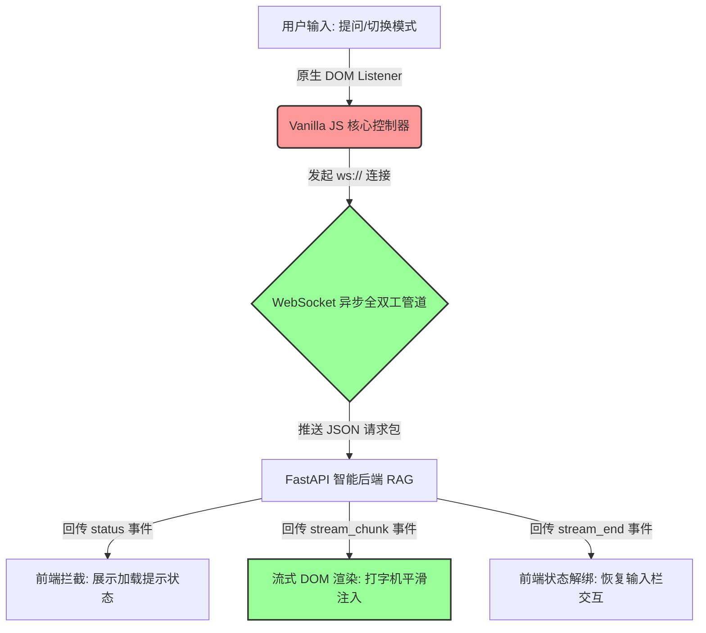

# 24-frontend · 纯原生企业级 AI 聊天终端

## 🎯 核心目标与应用场景
严格遵循团队技能准则，抛弃 React/Vue 等重型虚拟 DOM 框架，采用**原生的 HTML5 + Vanilla JS + 现代 CSS 变量驱动**，打造一个性能极致、毫秒级响应的企业级知识库 (RAG) 网页终端。

**应用场景**：
1. **高敏捷轻量入口**：适用于对前端包体积、加载速度有极致要求（0KB 业务依赖）的内部后台系统嵌入。
2. **WebSocket 实时流渲染**：专为大模型打字机效果、长连接流式响应（SSE/WS）设计的专属通信面板。
3. **高定视觉开发体验**：直接操控原生 DOM 与 CSS，打破框架黑盒，完美实现毛玻璃 (Glassmorphism) 与炫酷的流转动画。

---

## 🧠 技术原理与架构流程图

### 核心架构与开发思路
本系统采用**纯原生解耦**的设计哲学，将视觉层与数据链路彻底物理隔离：
1. **样式架构 (CSS Variable + Glassmorphism)**：在 `src/style.css` 的 `:root` 节点抽取了所有的调色板和毛玻璃参数。修改这里的一行代码即可完成企业级换肤。
2. **状态管理 (Vanilla JS Closures)**：没有臃肿的 Redux/Zustand，通过 `src/main.js` 顶部的局部变量闭包直接追踪 WebSocket 的实例状态 (`ws`) 和流转态 (`isStreaming`)。
3. **管道式 DOM 注入**：利用原生 WebSocket 的 `onmessage` 钩子监听，根据不同消息分发状态，将大模型传回的 Markdown 切片零延迟地以 `textContent` 追加入聊天气泡。



---

## 🛠️ 操作方法与执行命令 (二次开发方法)

**1. 极速启动**
```bash
# 进入 frontend 目录
cd frontend
# 借助 Vite 的开发服务器 (Dev Server) 实现本地秒级热更新，无需配置 Nginx
npm run dev
```

**2. 二次开发指南**
*   **企业 UI 主题化定制**：直接编辑 `src/style.css`。无需查阅任何组件库文档，修改 `:root` 里的 `--bg-base` 和 `--accent-blue` 即可直接改变页面暗色底纹和品牌主色调。
*   **通信协议扩展**：打开 `src/main.js`，定位到 `ws.onmessage`。如果你后端想增加一个“返回相关文档来源(Source)”的功能，只需在这里新增一个 `else if (data.type === 'source_links')` 分支，动态拼接一个 `<a>` 标签插入 DOM 即可。
*   **扩展交互面板**：想要加入历史会话侧边栏？直接在 `index.html` 的 `<aside>` 标签内编写 `<ul id="historyList">`，并在 `main.js` 中使用 `document.getElementById` 绑定点击事件，这比在 React 里传递 Props 和上下文要直观得多。

---

## ⚠️ 注意事项与踩坑记录

- **XSS 注入防护**：在极速模式下，大模型如果输出恶意的 HTML 代码串。由于我们是原生开发，**绝对禁止**将 `chunk.content` 使用 `.innerHTML` 赋值，目前代码已强制使用 `.textContent` 和 `escapeHtml` 来确保内容被当作纯文本安全转义。
- **WebSocket 幽灵断线问题**：网络波动会导致连接意外死亡。代码中已经在 `ws.onclose` 钩子里设计了 `setTimeout(connectWebSocket, 3000)` 的**退避重连机制**，切忌将其设为 0ms，否则服务器瞬间恢复时将面临重连 Ddos 风暴。
- **Vite 历史包袱清理**：该目录曾经是 React 脚手架。虽然现在完美使用了原生的写法并依靠 Vite 运行，但请注意 `package.json` 中的 React 依赖属于残留冗余。未来构建正式生产包时，可以将它们手动摘除以保证 0 依赖纯净。
